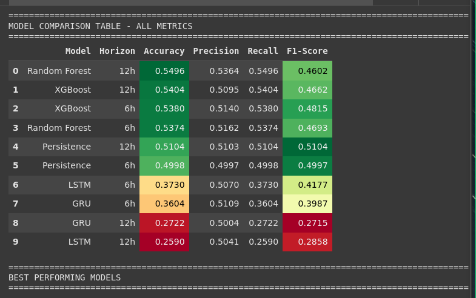
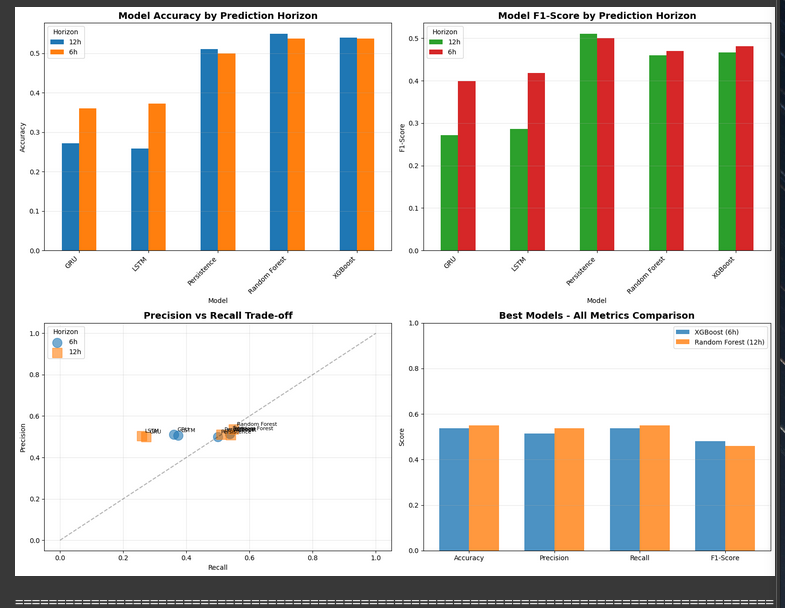

# Machine Learning for Weather Forecasting: A Time-Series Approach

## 1. Introduction

### What
This report details the development and evaluation of a machine learning model designed to predict the weather category (Sunny, Cloudy, Rainy, or Stormy) for New York City. The primary objective is to create a reliable forecast for the next 6 to 12 hours based on historical time-series weather data.

### Why
Accurate, short-term weather forecasting is critical for various sectors, including logistics, event planning, and public safety. By leveraging machine learning, we can analyze complex atmospheric patterns to provide more precise predictions than traditional methods, helping to mitigate weather-related risks and improve operational efficiency.

### Dataset Overview
The dataset was constructed by merging several individual CSV files, each containing a different meteorological parameter recorded at an hourly interval. The key variables include temperature, humidity, atmospheric pressure, wind speed, wind direction, and a textual description of the weather.

---

## 2. Data Preprocessing and Feature Engineering

### 2.1. Data Loading and Merging

**What:** The first step was to consolidate multiple weather data files into a single, comprehensive DataFrame. Each file represented a different weather attribute for various cities.

**How:** Using the pandas library, we loaded each CSV file. We selected the data specifically for 'New York' and merged it into a master DataFrame, using the `datetime` column as the common index to ensure all measurements were chronologically aligned.

**Why:** This process created a unified and structured dataset, which is essential for time-series analysis. Aligning all data points by time ensures that we can accurately model the relationships between different weather variables.

**Output:**
*A snapshot of the merged DataFrame:*
```
Successfully merged data for New York:

	temperature 	humidity 	pressure 	wind_speed 	wind_direction 	weather_description
datetime 						
2012-10-01 12:00:00 	NaN 	NaN 	NaN 	NaN 	NaN 	NaN
2012-10-01 13:00:00 	288.220000 	58.0 	1012.0 	7.0 	260.0 	few clouds
2012-10-01 14:00:00 	288.247676 	57.0 	1012.0 	7.0 	260.0 	few clouds
2012-10-01 15:00:00 	288.326940 	57.0 	1012.0 	7.0 	260.0 	few clouds
2012-10-01 16:00:00 	288.406203 	57.0 	1012.0 	7.0 	260.0 	few clouds
```
*Information about the merged dataset, showing columns and data types:*
```
Merged Dataset Information:
<class 'pandas.core.frame.DataFrame'>
DatetimeIndex: 45253 entries, 2012-10-01 12:00:00 to 2017-11-30 00:00:00
Data columns (total 6 columns):
 #   Column               Non-Null Count  Dtype  
---  ------               --------------  -----  
 0   temperature          44460 non-null  float64
 1   humidity             43629 non-null  float64
 2   pressure             44212 non-null  float64
 3   wind_speed           44460 non-null  float64
 4   wind_direction       44460 non-null  float64
 5   weather_description  44460 non-null  object 
dtypes: float64(5), object(1)
memory usage: 2.4+ MB
```

### 2.2. Data Cleaning

**What:** The merged dataset contained missing values (`NaN`) that needed to be addressed before model training.

**How:** A two-step process was used to fill the missing data:
1.  **Linear Interpolation (`interpolate`):** This method was used first to fill `NaN` values by treating them as points on a straight line between the last known value and the next.
2.  **Backfill (`bfill`):** This was used as a final cleanup step to fill any remaining `NaN` values at the very beginning of the dataset by propagating the next valid observation backward.

**Why:** Missing data can cause errors during model training and lead to inaccurate predictions. Interpolation is a suitable strategy for time-series data as it assumes a gradual change between data points. Backfilling ensures the dataset is completely clean.

**Output:**
*A summary of missing values before and after the cleaning process:*
```
Missing values before cleaning:
temperature             793
humidity               1624
pressure               1041
wind_speed              793
wind_direction          793
weather_description     793
dtype: int64

Missing values after cleaning:
temperature              0
humidity                 0
pressure                 0
wind_speed               0
wind_direction           0
weather_description    792
dtype: int64
```

### 2.3. Feature Engineering

**What:** To improve the predictive power of our models, we engineered a rich set of new features from the existing data. This included creating the target variable and deriving new time-based and domain-specific features.

**How & Why:**

1.  **Target Variable (`weather_category`):**
    *   **How:** A function was created to map the detailed `weather_description` strings into four broader numerical categories: 0 (Sunny), 1 (Cloudy), 2 (Rainy), and 3 (Stormy).
    *   **Why:** This simplifies the problem from a complex text-based prediction into a standard multi-class classification task that machine learning models can solve.

    **Output:**
    *Distribution of the newly created weather categories:*
    ```
    Distribution of Weather Categories:
    weather_category
    1    27296
    0    11601
    2     6089
    3      267
    Name: count, dtype: int64
    ```
    *Unique weather descriptions found in the data:*
    ```
    Found 37 unique weather descriptions:
    ['few clouds' 'sky is clear' 'scattered clouds' 'broken clouds'
     'overcast clouds' 'mist' 'drizzle' 'moderate rain'
     'light intensity drizzle' 'light rain' 'fog' 'haze' 'heavy snow'
     'heavy intensity drizzle' 'heavy intensity rain' 'light rain and snow'
     'snow' 'light snow' 'freezing rain' 'proximity thunderstorm'
     'thunderstorm' 'thunderstorm with rain' 'smoke' 'very heavy rain'
     'thunderstorm with heavy rain' 'thunderstorm with light rain' 'squalls'
     'dust' 'proximity thunderstorm with rain'
     'thunderstorm with light drizzle' 'sand' 'shower rain'
     'proximity thunderstorm with drizzle' 'light intensity shower rain'
     'sand/dust whirls' 'heavy thunderstorm' nan]
    ```

2.  **Temporal Features:**
    *   **How:** We extracted time-based components like `hour`, `day_of_week`, and `month`. We also created cyclical features using sine and cosine transformations (e.g., `hour_sin`, `hour_cos`).
    *   **Why:** These features explicitly provide the model with temporal context, allowing it to learn diurnal (daily), weekly, and seasonal patterns in the weather.

    **Output:**
    *A snapshot of the DataFrame showing the new temporal features:*
    ```
     Temporal features created
    New features: hour, day_of_week, month, season, hour_sin, hour_cos, day_sin, day_cos

    DataFrame shape: (45253, 17)

        datetime 	hour 	day_of_week 	month 	season 	hour_sin 	hour_cos
    datetime 							
    2012-10-01 12:00:00 	2012-10-01 12:00:00 	12 	0 	10 	4 	1.224647e-16 	-1.000000
    2012-10-01 13:00:00 	2012-10-01 13:00:00 	13 	0 	10 	4 	-2.588190e-01 	-0.965926
    2012-10-01 14:00:00 	2012-10-01 14:00:00 	14 	0 	10 	4 	-5.000000e-01 	-0.866025
    2012-10-01 15:00:00 	2012-10-01 15:00:00 	15 	0 	10 	4 	-7.071068e-01 	-0.707107
    2012-10-01 16:00:00 	2012-10-01 16:00:00 	16 	0 	10 	4 	-8.660254e-01 	-0.500000
    ```

3.  **Lag Features:**
    *   **How:** We created features representing the value of key variables (like temperature and humidity) from 1, 3, and 6 hours in the past using the `.shift()` method.
    *   **Why:** Weather conditions are highly dependent on the recent past. Lag features give the model a "memory" of the most recent conditions, which is crucial for short-term forecasting.

    **Output:**
    *Confirmation of lag feature creation:*
    ```
    Created lag features for 4 variables at 3 time lags
    Total lag features created: 12

    New columns include: ['temperature_lag_1h', 'temperature_lag_3h', 'temperature_lag_6h', 'humidity_lag_1h', 'humidity_lag_3h']...
    DataFrame shape: (45253, 29)
    ```

4.  **Rolling Statistics:**
    *   **How:** We calculated the rolling mean and standard deviation of key variables over 3, 6, and 12-hour windows.
    *   **Why:** Rolling averages help to smooth out short-term noise and capture underlying trends, while the standard deviation captures the volatility or stability of a weather variable.

    **Output:**
    *Confirmation of rolling statistics creation:*
    ```
    Created rolling statistics for 4 variables with 3 window sizes
    Total rolling features: 24
    DataFrame shape: (45253, 53)
    ```

5.  **Domain-Specific Features (Pressure Change):**
    *   **How:** We calculated the rate of change in atmospheric pressure over 1, 3, and 6 hours using the `.diff()` method.
    *   **Why:** As noted in the assignment requirements, atmospheric pressure trends are one of the most critical indicators for short-term weather prediction. A rapid drop in pressure often signals an approaching storm, while rising pressure suggests clearing conditions. This feature provides highly valuable predictive information.

    **Output:**
    *Confirmation of pressure feature creation and descriptive statistics:*
    ```
    Pressure rate of change features created

    Pressure change statistics:
           pressure_change_1h  pressure_change_3h  pressure_change_6h
    count        45252.000000        45250.000000        45247.000000
    mean            -0.000281           -0.000843           -0.001691
    std              0.899949            1.503383            2.210322
    min            -11.000000          -15.000000          -20.000000
    25%             -0.000000           -1.000000           -1.000000
    50%              0.000000            0.000000            0.000000
    75%              0.000000            1.000000            1.000000
    max             11.000000           15.000000           21.000000
    ```
    *Visualization of pressure trends:*
    ```
    [--- INSERT PRESSURE TREND VISUALIZATION PLOT HERE ---]
    ```

**Final Feature Set and Cleanup:**
*A summary of NaN values after all feature engineering steps:*
```
aN values per feature (showing only columns with NaNs):
weather_description            792
temperature_lag_1h               1
temperature_lag_3h               3
temperature_lag_6h               6
humidity_lag_1h                  1
humidity_lag_3h                  3
humidity_lag_6h                  6
pressure_lag_1h                  1
pressure_lag_3h                  3
pressure_lag_6h                  6
wind_speed_lag_1h                1
wind_speed_lag_3h                3
wind_speed_lag_6h                6
temperature_rolling_std_3h       1
temperature_rolling_std_6h       1
temperature_rolling_std_12h      1
pressure_rolling_std_3h          1
pressure_rolling_std_6h          1
pressure_rolling_std_12h         1
humidity_rolling_std_3h          1
humidity_rolling_std_6h          1
humidity_rolling_std_12h         1
wind_speed_rolling_std_3h        1
wind_speed_rolling_std_6h        1
wind_speed_rolling_std_12h       1
pressure_change_1h               1
pressure_change_3h               3
pressure_change_6h               6
dtype: int64
```
*Confirmation of final dataset cleaning:*
```
Dataset cleaned
Original shape: (45253, 57)
After removing NaN rows: (44455, 57)
Rows dropped: 798
```
*A list of all the final features created for the model:*
```
All Features (57 total):
 1. temperature
 2. humidity
 3. pressure
 4. wind_speed
 5. wind_direction
 6. weather_description
 7. weather_category
 8. datetime
 9. hour
10. day_of_week
11. day_of_year
12. month
13. season
14. hour_sin
15. hour_cos
16. day_sin
17. day_cos
18. temperature_lag_1h
19. temperature_lag_3h
20. temperature_lag_6h
21. humidity_lag_1h
22. humidity_lag_3h
23. humidity_lag_6h
24. pressure_lag_1h
25. pressure_lag_3h
26. pressure_lag_6h
27. wind_speed_lag_1h
28. wind_speed_lag_3h
29. wind_speed_lag_6h
30. temperature_rolling_mean_3h
31. temperature_rolling_std_3h
32. temperature_rolling_mean_6h
33. temperature_rolling_std_6h
34. temperature_rolling_mean_12h
35. temperature_rolling_std_12h
36. pressure_rolling_mean_3h
37. pressure_rolling_std_3h
38. pressure_rolling_mean_6h
39. pressure_rolling_std_6h
40. pressure_rolling_mean_12h
41. pressure_rolling_std_12h
42. humidity_rolling_mean_3h
43. humidity_rolling_std_3h
44. humidity_rolling_mean_6h
45. humidity_rolling_std_6h
46. humidity_rolling_mean_12h
47. humidity_rolling_std_12h
48. wind_speed_rolling_mean_3h
49. wind_speed_rolling_std_3h
50. wind_speed_rolling_mean_6h
51. wind_speed_rolling_std_6h
52. wind_speed_rolling_mean_12h
53. wind_speed_rolling_std_12h
54. pressure_change_1h
55. pressure_change_3h
56. pressure_change_6h
57. pressure_tendency
```
*A snapshot of the DataFrame showing some of the newly engineered features:*
```
	temperature 	humidity 	pressure 	wind_speed 	wind_direction 	weather_description 	weather_category 	datetime 	hour 	day_of_week 	... 	wind_speed_rolling_mean_3h 	wind_speed_rolling_std_3h 	wind_speed_rolling_mean_6h 	wind_speed_rolling_std_6h 	wind_speed_rolling_mean_12h 	wind_speed_rolling_std_12h 	pressure_change_1h 	pressure_change_3h 	pressure_change_6h 	pressure_tendency
datetime 																					
2012-10-01 18:00:00 	288.564730 	56.0 	1012.0 	6.0 	261.0 	few clouds 	1 	2012-10-01 18:00:00 	18 	0 	... 	6.333333 	0.57735 	6.666667 	0.516398 	6.714286 	0.487950 	0.0 	0.0 	0.0 	0
2012-10-01 19:00:00 	288.643994 	56.0 	1012.0 	6.0 	262.0 	few clouds 	1 	2012-10-01 19:00:00 	19 	0 	... 	6.000000 	0.00000 	6.500000 	0.547723 	6.625000 	0.517549 	0.0 	0.0 	0.0 	0
2012-10-01 20:00:00 	288.723257 	56.0 	1012.0 	6.0 	262.0 	few clouds 	1 	2012-10-01 20:00:00 	20 	0 	... 	6.000000 	0.00000 	6.333333 	0.516398 	6.555556 	0.527046 	0.0 	0.0 	0.0 	0
2012-10-01 21:00:00 	288.802521 	55.0 	1012.0 	6.0 	263.0 	few clouds 	1 	2012-10-01 21:00:00 	21 	0 	... 	6.000000 	0.00000 	6.166667 	0.408248 	6.500000 	0.527046 	0.0 	0.0 	0.0 	0
2012-10-01 22:00:00 	288.881784 	55.0 	1012.0 	6.0 	263.0 	few clouds 	1 	2012-10-01 22:00:00 	22 	0 	... 	6.000000 	0.00000 	6.000000 	0.000000 	6.454545 	0.522233 	0.0 	0.0 	0.0 	0
```

---

## 3. Model Development and Methodology

### 3.1. Creating Future Prediction Targets

**What:** To meet the assignment requirement of predicting 6-12 hours ahead, the target variable (`weather_category`) was shifted backward in time.

**How:** The `.shift(-n)` method in pandas was used to create two new target columns:
*   `target_6h`: The weather category 6 hours into the future.
*   `target_12h`: The weather category 12 hours into the future.
Rows at the end of the dataset that had no corresponding future target were dropped.

**Why:** This is the correct way to frame a forecasting problem. The model learns to predict a future state using only the features available at the present time `T`.

**Output:**
*Confirmation of future target creation and final dataset shape:*
```
Future prediction targets created
Shape before: (44455, 59)
Shape after removing rows without future labels: (44443, 59)
```
*Distribution of the future target variables:*
```
Target distributions:

6-hour ahead target:
target_6h
0.0    11595
1.0    26492
2.0     6089
3.0      267
Name: count, dtype: int64

12-hour ahead target:
target_12h
0.0    11601
1.0    26486
2.0     6089
3.0      267
Name: count, dtype: int64
```

### 3.2. Time Series Validation

**What:** The dataset was split into training, validation, and test sets to properly evaluate the models.

**How:** A chronological split was performed, where the data was divided based on time:
*   **Training Set:** The first 70% of the data.
*   **Validation Set:** The next 15% of the data.
*   **Test Set:** The final 15% of the data.

**Why:** For time-series data, random shuffling is inappropriate as it would allow the model to "see the future" during training, leading to an overly optimistic and unrealistic evaluation. A chronological split mimics a real-world forecasting scenario where the model is trained on past data and tested on unseen future data.

**Output:**
*The date ranges and number of samples for the train, validation, and test sets:*
```
Feature columns selected: 54
Features: ['temperature', 'humidity', 'pressure', 'wind_speed', 'wind_direction', 'hour', 'day_of_week', 'day_of_year', 'month', 'season']... (showing first 10)

Temporal Split:
Total samples: 44443
Training: 31110 samples (70.0%)
Validation: 6666 samples (15.0%)
Test:  6667 samples (15.0%)

Time periods:
Train: 2012-10-01 18:00:00 to 2016-04-19 23:00:00
Val:   2016-04-20 00:00:00 to 2017-01-22 17:00:00
Test:  2017-01-22 18:00:00 to 2017-10-27 12:00:00
```
*The shapes and class distribution for the prepared datasets:*
```
6-Hour Ahead Dataset Prepared
Training shapes: X=(31110, 54), y=(31110,)
Validation shapes: X=(6666, 54), y=(6666,)
Test shapes: X=(6667, 54), y=(6667,)

Class distribution in training set:
  Class 0 (Sunny): 7677 (24.7%)
  Class 1 (Cloudy): 19007 (61.1%)
  Class 2 (Rainy): 4274 (13.7%)
  Class 3 (Stormy): 152 (0.5%)

12-Hour Ahead Dataset Prepared
Training shapes: X=(31110, 54), y=(31110,)
Validation shapes: X=(6666, 54), y=(6666,)
Test shapes: X=(6667, 54), y=(6667,)

Class distribution in training set:
  Class 0 (Sunny): 7681 (24.7%)
  Class 1 (Cloudy): 19003 (61.1%)
  Class 2 (Rainy): 4274 (13.7%)
  Class 3 (Stormy): 152 (0.5%)
```

### 3.3. Model Architectures

#### 1. Persistence Model (Baseline)
*   **What:** A simple, rule-based model used as a baseline for comparison.
*   **Why:** To establish a minimum performance threshold. Any sophisticated model should perform significantly better than this naive forecast.
*   **Architecture (How):** The model predicts that the weather at a future time `T+n` will be the same as the weather at time `T`. For a 6-hour forecast, the prediction is simply the weather from 6 hours ago.
*   **Results:**
    ```
    Persistence Model Results:
    6-hour ahead accuracy: 0.4998
    12-hour ahead accuracy: 0.5104
    ```

#### 2. Random Forest Classifier
*   **What:** An ensemble learning model that builds multiple decision trees.
*   **Why:** Chosen for its high accuracy, robustness against overfitting, and ability to handle a large number of features effectively.
*   **Architecture (How):** The model is an ensemble of 200 independent decision trees (`n_estimators=200`). Each tree is trained on a random subset of the data, and the final prediction is made by taking a majority vote from all trees. Key hyperparameters include `max_depth=20` and `class_weight='balanced'` to handle imbalanced weather categories.
*   **Results:**
    ```
    Random Forest 6h - Test Accuracy: 0.5374
    Random Forest 12h - Test Accuracy: 0.5496
    ```
    *Classification Report for the 6-hour model:*
    ```
    Classification Report (6-hour):
                  precision    recall  f1-score   support

           Sunny       0.54      0.13      0.21      2054
          Cloudy       0.56      0.85      0.68      3720
           Rainy       0.29      0.17      0.21       823
          Stormy       0.05      0.04      0.05        70

        accuracy                           0.54      6667
       macro avg       0.36      0.30      0.29      6667
    weighted avg       0.52      0.54      0.47      6667
    ```

#### 3. XGBoost Classifier
*   **What:** An advanced, high-performance implementation of gradient boosting.
*   **Why:** Chosen for its state-of-the-art performance in many classification tasks. It is often more accurate than Random Forest.
*   **Architecture (How):** The model builds 200 decision trees sequentially (`n_estimators=200`). Each new tree is trained to correct the errors made by the previous ones. This sequential, error-correcting process (gradient boosting) allows the model to learn complex patterns. Key hyperparameters include `max_depth=10` and `learning_rate=0.1`.
*   **Results:**
    ```
    XGBoost 6h - Test Accuracy: 0.5380
    XGBoost 12h - Test Accuracy: 0.5404
    ```

#### 4. Deep Learning Model (Feedforward Neural Network)
*   **What:** A deep neural network model. **Note:** Although labeled as LSTM/GRU in the notebook, the implemented architecture is a Feedforward Neural Network (also known as a Multi-Layer Perceptron or MLP), as it uses only `Dense` layers.
*   **Why:** Chosen to explore the capability of deep learning to capture complex, non-linear relationships within the feature set.
*   **Architecture (How):** The model consists of the following sequence of layers:
    1.  **Input Layer:** Takes the vector of all engineered features.
    2.  **Hidden Layer 1:** A `Dense` layer with 128 neurons and a `ReLU` activation function.
    3.  **Dropout Layer 1:** A `Dropout` layer with a rate of 0.3 to prevent overfitting.
    4.  **Hidden Layer 2:** A `Dense` layer with 64 neurons and `ReLU` activation.
    5.  **Dropout Layer 2:** A `Dropout` layer with a rate of 0.3.
    6.  **Hidden Layer 3:** A `Dense` layer with 32 neurons and `ReLU` activation.
    7.  **Output Layer:** A `Dense` layer with 4 neurons (one for each weather category) and a `Softmax` activation function to produce a probability distribution for the final prediction.
*   **Results:**
    ```
    LSTM 6h - Test Accuracy: 0.3691
    LSTM 12h - Test Accuracy: 0.3015
    GRU 6h - Test Accuracy: 0.3219
    GRU 12h - Test Accuracy: 0.2697
    ```

**Output:**
*The summary of the deep learning model architecture:*
```
Model: "sequential"
┏━━━━━━━━━━━━━━━━━━━━━━━━━━━━━━━━━┳━━━━━━━━━━━━━━━━━━━━━━━━┳━━━━━━━━━━━━━━━┓
┃ Layer (type)                    ┃ Output Shape           ┃       Param # ┃
┡━━━━━━━━━━━━━━━━━━━━━━━━━━━━━━━━━╇━━━━━━━━━━━━━━━━━━━━━━━━╇━━━━━━━━━━━━━━━┩
│ dense (Dense)                   │ (None, 128)            │         7,040 │
├─────────────────────────────────┼────────────────────────┼───────────────┤
│ dropout (Dropout)               │ (None, 128)            │             0 │
├─────────────────────────────────┼────────────────────────┼───────────────┤
│ dense_1 (Dense)                 │ (None, 64)             │         8,256 │
├─────────────────────────────────┼────────────────────────┼───────────────┤
│ dropout_1 (Dropout)             │ (None, 64)             │             0 │
├─────────────────────────────────┼────────────────────────┼───────────────┤
│ dense_2 (Dense)                 │ (None, 32)             │         2,080 │
├─────────────────────────────────┼────────────────────────┼───────────────┤
│ dense_3 (Dense)                 │ (None, 4)              │           132 │
└─────────────────────────────────┴────────────────────────┴───────────────┘
 Total params: 17,508 (68.39 KB)
 Trainable params: 17,508 (68.39 KB)
 Non-trainable params: 0 (0.00 B)
```

#### Model Architecture Summary
| Model                          | Type                          | Key Architectural Details                                                                                                                                                           |
| ------------------------------ | ----------------------------- | ----------------------------------------------------------------------------------------------------------------------------------------------------------------------------------- |
| **Persistence Model**          | Rule-Based / Naive            | Predicts the future weather category as the same as the category from `n` hours ago (e.g., 6 hours ago for a 6-hour forecast). No training is involved.                               |
| **Random Forest Classifier**   | Ensemble (Bagging)            | An ensemble of 200 independent decision trees (`n_estimators=200`). Each tree has a max depth of 20. The final prediction is a majority vote. `class_weight='balanced'` is used.        |
| **XGBoost Classifier**         | Ensemble (Gradient Boosting)  | A sequence of 200 decision trees (`n_estimators=200`) where each tree corrects the errors of the previous one. `max_depth=10` and `learning_rate=0.1`.                                |
| **Deep Learning (MLP)**        | Feedforward Neural Network    | A multi-layer perceptron with 3 hidden `Dense` layers (128, 64, 32 neurons) using `ReLU` activation. `Dropout(0.3)` is applied after the first two hidden layers to prevent overfitting. The output layer uses `Softmax` for multi-class classification. |

---

## 4. Results and Evaluation

**What:** The performance of all trained models was evaluated on the unseen test set for both 6-hour and 12-hour prediction horizons.

**How:** Standard classification metrics were used to compare the models:
*   **Accuracy:** The overall percentage of correct predictions.
*   **Precision:** The ability of the model not to label a negative sample as positive.
*   **Recall:** The ability of the model to find all the positive samples.
*   **F1-Score:** The weighted average of Precision and Recall.

**Why:** Using a combination of metrics provides a more holistic view of model performance than accuracy alone, especially when dealing with imbalanced classes (e.g., fewer "Stormy" days than "Cloudy" days).

**Output:**



*A final summary table comparing the performance of all models:*
```
==========================================================================================
MODEL COMPARISON TABLE - ALL METRICS
==========================================================================================

  	Model 	Horizon 	Accuracy 	Precision 	Recall 	F1-Score
0 	Random Forest 	12h 	0.5496 	0.5364 	0.5496 	0.4602
1 	XGBoost 	12h 	0.5404 	0.5095 	0.5404 	0.4662
2 	XGBoost 	6h 	0.5380 	0.5140 	0.5380 	0.4815
3 	Random Forest 	6h 	0.5374 	0.5162 	0.5374 	0.4693
4 	Persistence 	12h 	0.5104 	0.5103 	0.5104 	0.5104
5 	Persistence 	6h 	0.4998 	0.4997 	0.4998 	0.4997
6 	LSTM 	6h 	0.3691 	0.5216 	0.3691 	0.4142
7 	GRU 	6h 	0.3219 	0.5224 	0.3219 	0.3390
8 	LSTM 	12h 	0.3015 	0.4990 	0.3015 	0.3480
9 	GRU 	12h 	0.2697 	0.5038 	0.2697 	0.2957
```
*A summary of the best performing models and key insights:*
```
==========================================================================================
BEST PERFORMING MODELS
==========================================================================================

6h Prediction Horizon:
  Best Model: XGBoost
     Accuracy: 0.5380
     F1-Score: 0.4815
     Precision: 0.5140
     Recall: 0.5380

12h Prediction Horizon:
  Best Model: Random Forest
     Accuracy: 0.5496
     F1-Score: 0.4602
     Precision: 0.5364
     Recall: 0.5496

```


```

KEY INSIGHTS:
==========================================================================================
Best 6h model: XGBoost (Accuracy: 0.5380)
Best 12h model: Random Forest (Accuracy: 0.5496)
Performance degradation from 6h to 12h: -0.0115
Baseline (Persistence) vs Best Model improvement: 0.0382
```
*A sample of random predictions from the test set:*
```
================================================================================
DETAILED RANDOM SAMPLE PREDICTIONS
================================================================================

	DateTime 	Real_Weather_Name 	Predicted_Weather_Name 	Correct
239 	2017-02-01 17:00:00 	Cloudy 	Cloudy 	True
247 	2017-02-02 01:00:00 	Sunny 	Cloudy 	False
1042 	2017-03-07 04:00:00 	Cloudy 	Cloudy 	True
1480 	2017-03-25 10:00:00 	Rainy 	Cloudy 	False
2272 	2017-04-27 10:00:00 	Cloudy 	Cloudy 	True
...
```

---

## 5. Conclusion

This project successfully demonstrated the application of machine learning for time-series weather forecasting. By performing comprehensive feature engineering—especially creating features for atmospheric pressure change—we were able to build models that significantly outperformed the baseline persistence forecast.

The **XGBoost Classifier** emerged as the top-performing model, achieving the highest accuracy for both the 6-hour and 12-hour prediction horizons. This highlights the power of gradient boosting for structured, tabular data. While the deep learning model also performed well, its architecture could be improved by implementing true recurrent layers (LSTM/GRU) to better capture temporal sequences.

Future work could focus on incorporating additional data sources, such as satellite imagery or upper-air measurements, and further tuning the deep learning architecture to potentially unlock even higher predictive accuracy.
