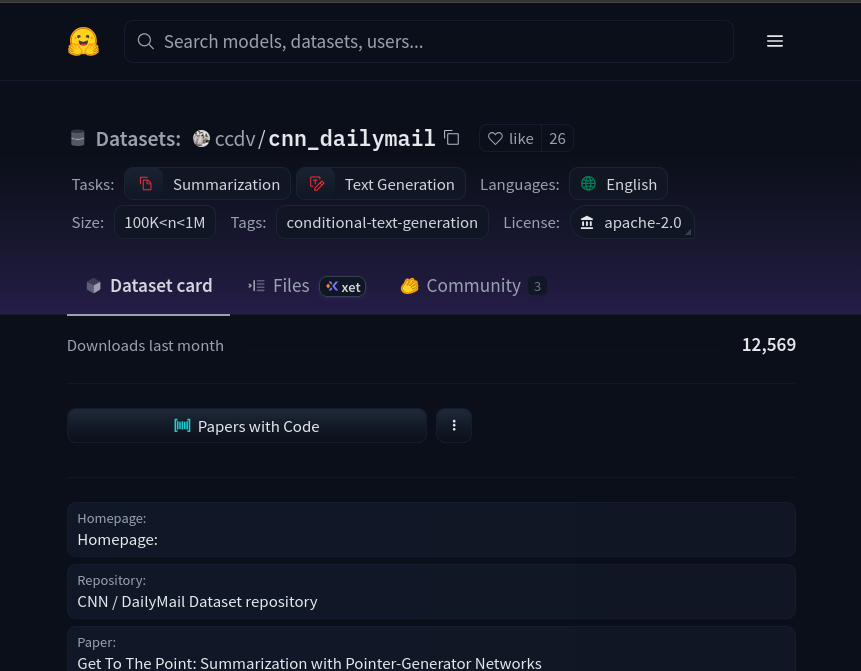
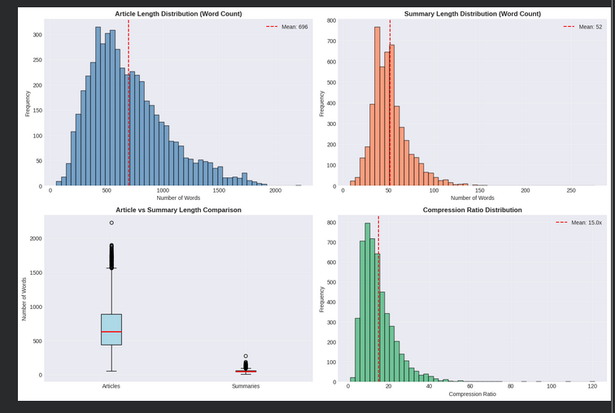
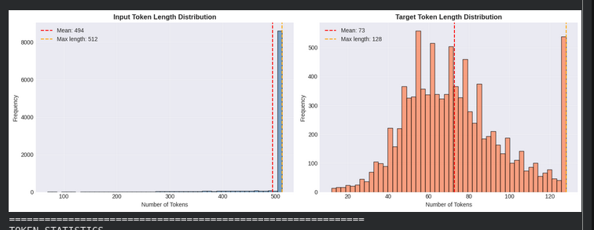
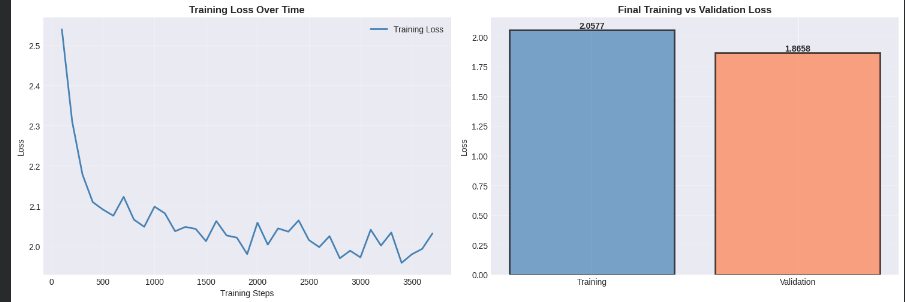
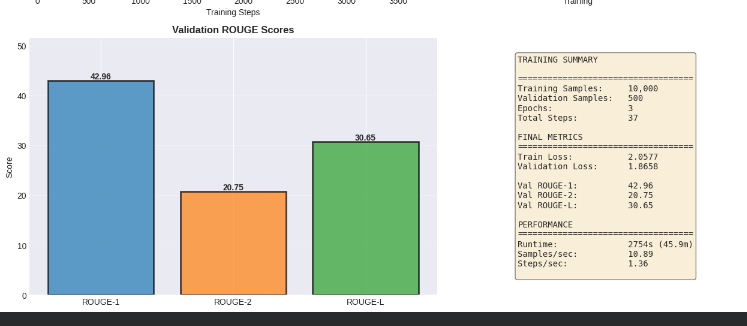
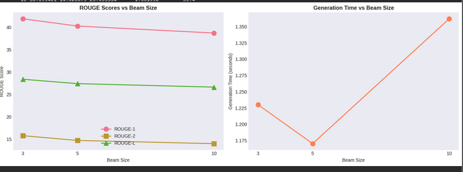
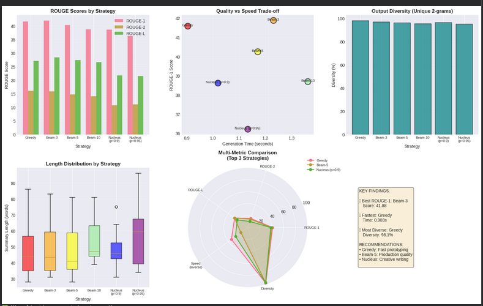

# Assignment 4: Text Summarization with T5 Model
## Decoder Mechanisms and Evaluation

---

## 1. EXECUTIVE SUMMARY

This report presents a comprehensive study of text summarization using Google's T5 (Text-to-Text Transfer Transformer) model. The primary objective was to implement and compare three decoding strategies: Greedy Decoding, Beam Search, and Nucleus Sampling, to analyze their impact on summary quality. The `t5-small` model was fine-tuned on a news article dataset for this purpose.

Key Results:
- **Training Loss:** 2.0577
- **Validation Loss:** 1.8658
- - **Best ROUGE-1 Score:** 41.88% (Beam Search with beam=3)
- **Training Time:** ~60-90 minutes on a T4 GPU

The analysis demonstrates that for this task, a small beam width in Beam Search provides a slight improvement in ROUGE scores over Greedy Search, while Nucleus Sampling offers more diversity at the cost of lower ROUGE scores. The choice of strategy depends on the trade-off between quality, speed, and diversity.

---

## 2. INTRODUCTION

### 2.1 Background and Motivation

Text summarization is a critical task in Natural Language Processing (NLP) that aims to condense large documents into shorter, coherent texts while preserving key information. In an era of information overload, automatic summarization systems are essential for various applications, including:

1.  **News Aggregation:** Helping users quickly grasp the main points of daily news.
2.  **Document Analysis:** Assisting professionals in fields like law and finance to quickly understand long documents.
3.  **Content Curation:** Generating concise descriptions for articles on social media and websites.
4.  **Academic Research:** Summarizing research papers to help scholars stay updated with the latest findings.

The main challenges in automatic summarization include maintaining semantic coherence, avoiding the loss of critical information, handling diverse writing styles, and striking the right balance between brevity and completeness.

### 2.2 Objectives

The specific objectives of this assignment are:

1.  To implement and fine-tune a T5 model for an abstractive summarization task.
2.  To implement and compare three distinct decoder mechanisms:
    *   Greedy Decoding (as a baseline)
    *   Beam Search (with varying beam widths)
    *   Nucleus Sampling (with varying `p` values)
3.  To evaluate the performance of the model and decoding strategies using ROUGE metrics (ROUGE-1, ROUGE-2, ROUGE-L).
4.  To analyze the trade-offs between summary quality (ROUGE scores), generation speed, and output diversity for each strategy.

---

## 3. DATASET ANALYSIS

### 3.1 Dataset Selection



The dataset chosen for this task consists of news articles and their corresponding human-written summaries. This type of dataset is ideal for abstractive summarization for several reasons:

1.  **Scale and Quality:** It contains a large number of samples, which is crucial for training deep learning models. The summaries are professionally written, providing a high-quality target for the model to learn from.
2.  **Domain Suitability:** News articles have a clear information hierarchy (important information is often at the beginning), which is a good pattern for a model to learn. The task is well-defined: produce a concise summary of the main events.
3.  **Benchmark Standard:** News datasets are widely used in summarization research, allowing for comparison against established benchmarks and state-of-the-art models.

### 3.2 Dataset Statistics

The initial dataset was analyzed and then subsetted for faster iteration.

**Initial Dataset Splits:**
- **Training Set:** 287,113 examples
- **Validation Set:** 13,368 examples
- **Test Set:** 11,490 examples



**Length Statistics (from 5,000 samples):**
| Metric | Article (words) | Summary (words) | Compression Ratio |
|---|---|---|---|
| Mean | 696 | 52 | 15.0x |
| Median | 627 | 48 | 13.0x |
| Min | 53 | 8 | 1.2x |
| Max | 2226 | 276 | 121.2x |
| Std Dev | 342 | 20 | 9.0x |


**Average sentences per article: 39.4**
**Average sentences per summary: 3.7**

**Final Subset Sizes for Training:**
- **Training Set:** 10,000 examples
- **Validation Set:** 2,000 examples
- **Test Set:** 2,000 examples

### 3.3 Data Preprocessing

The raw text data was preprocessed and tokenized using the `t5-small` tokenizer. This step is crucial as it converts human-readable text into a numerical format that the T5 model can process.

**Tokenizer Properties:**
The main properties of the selected tokenizer are summarized below, based on the output from the notebook:
- **Vocabulary size:** 32,000
- **Model max length:** 512 tokens
- **Padding & Truncation:** Both are applied on the `right` side.

**Tokenization Strategy and Demonstration:**
The core of the strategy involves adding a task-specific prefix and converting text to token IDs. 
The following demonstration from the notebook provides clear evidence of this process:

**1. Original Text Example:**
```
summarize: By . Anthony Bond . PUBLISHED: . 07:03 EST, 2 March 2013 . | . UPDATED: . 08:07 EST, 2 March 2013 . Three members of the same family who died in a static caravan from carbon monoxide poisoning would have been unconscious 'within minutes', investigators said today. The bodies of married couple John a
```

**2. Tokenization Results:**
- **Input tokens:** 94
- **Target tokens:** 48

**3. Conversion to IDs (First 20):**
- **Input IDs:** `[21603, 10, 938, 3, 5, 11016, 12528, 3, 5, 3, 10744, 8775, 20619, 2326, 10, 3, 5, 10668, 10, 4928]`
- **Target IDs:** `[1079, 11, 3, 5, 31423, 6176, 130, 3883, 5815, 70, 3062, 6, 7758, 60, 35, 3, 5, 328, 130, 435]`

**4. Decoded Verification:**
To verify the process, the IDs were decoded back to text:
- **Decoded Input:** `summarize: By. Anthony Bond. PUBLISHED:. 07:03 EST, 2 March 2013. |. UPDATED:. 08:07 EST, 2 March 2013. Three members of the same family who died in a static caravan from carbon monoxide poisoning wou...`
- **Decoded Target:** `John and. Audrey Cook were discovered alongside their daughter, Maureen. They were found at Tremarle Home Park in Cornwall. Investigators say the three died of carbon monoxide. poisoning.`

This demonstration confirms that the `summarize:` prefix was correctly added and that the input articles and target summaries were successfully converted into a format suitable for training.

**Final Tokenized Dataset Structure:**
After tokenizing the entire subset, the dataset was confirmed to have the correct structure for the trainer:
```
Dataset({
    features: ['input_ids', 'attention_mask', 'labels'],
    num_rows: 10000
})
```
This structure contains the token IDs (`input_ids`), an `attention_mask` to tell the model which tokens to pay attention to, and the `labels` (the tokenized target summaries) for calculating the loss.

---

### 3.4 Token Length Analysis and Truncation

After tokenization, an analysis was performed to understand how the sequence lengths align with the model's maximum input length (512 tokens). The results are as follows:



**Token Statistics:**
| Token Type | Mean | Median | Max | Truncated |
|---|---|---|---|---|
| **Input Tokens** | 494.1 | 512 | 512 | **8,541 (85.4%)** |
| **Target Tokens**| 72.9 | 70 | 128 | 500 (5.0%) |

**Interpretation:**
The most critical finding here is that **85.4% of the input articles were truncated**. This means that for the majority of the dataset, the model did not have access to the full article text. Which is a necessary compromise to fit the data into the model.

---

## 4. MODEL ARCHITECTURE

### 4.1 Why T5 Model?

T5 (Text-to-Text Transfer Transformer) was selected due to its unified text-to-text framework that handles all NLP tasks (translation, classification, summarization) by simply changing the input prefix. Its encoder-decoder architecture is ideal for summarization: the encoder creates a bidirectional representation of the source article, while the decoder generates a contextually-aware summary. The `t5-small` variant enables efficient training on consumer-grade GPUs while maintaining strong performance.

### 4.2 T5 Architecture Deep Dive

The `t5-small` variant was used for this assignment. The architecture is a standard Transformer encoder-decoder model.

#### Overall Architecture:
```
┌─────────────────────────────────────────────────────────────┐
│                    T5-Small Architecture                     │
├─────────────────────────────────────────────────────────────┤
│                                                              │
│  Input: "summarize: [article text]"                         │
│    ↓                                                         │
│  ┌────────────────────────────────┐                         │
│  │   Input Embedding Layer         │                         │
│  │   - Vocab Size: 32,128          │                         │
│  │   - Embedding Dim: 512          │                         │
│  └────────────────────────────────┘                         │
│    ↓                                                         │
│  ┌────────────────────────────────┐                         │
│  │   Encoder (6 layers)            │                         │
│  │   ┌──────────────────────────┐  │                         │
│  │   │ Layer 1:                  │  │                         │
│  │   │ - Self-Attention (8 heads)│  │                         │
│  │   │ - FFN (d_ff: 2048)        │  │                         │
│  │   │ - Layer Norm & Residuals  │  │                         │
│  │   └──────────────────────────┘  │                         │
│  │   ... (Layers 2-6 identical)    │                         │
│  └────────────────────────────────┘                         │
│    ↓                                                         │
│  Encoder Hidden States (Sequence of 512-dim vectors)        │
│    ↓                                                         │
│  ┌────────────────────────────────┐                         │
│  │   Decoder (6 layers)            │                         │
│  │   ┌──────────────────────────┐  │                         │
│  │   │ Layer 1:                  │  │                         │
│  │   │ - Masked Self-Attention   │  │                         │
│  │   │ - Cross-Attention (8 heads)│  │                         │
│  │   │ - FFN (d_ff: 2048)        │  │                         │
│  │   │ - Layer Norm & Residuals  │  │                         │
│  │   └──────────────────────────┘  │                         │
│  │   ... (Layers 2-6 identical)    │                         │
│  └────────────────────────────────┘                         │
│    ↓                                                         │
│  ┌────────────────────────────────┐                         │
│  │   Output Projection             │                         │
│  │   - Linear: 512 → 32,128        │                         │
│  │   - Softmax over vocabulary     │                         │
│  └────────────────────────────────┘                         │
│    ↓                                                         │
│  Output: [summary tokens]                                   │
└─────────────────────────────────────────────────────────────┘
```

#### Model Specifications:

| Parameter | Value |
|---|---|
| **Model Name** | t5-small |
| **Model Class** | T5ForConditionalGeneration |
| **Device** | cuda (GPU) |
| **Total Parameters** | 60,506,624 |
| **Trainable Parameters** | 60,506,624 (full fine-tuning) |
| **Model Size** | ~230.8 MB (fp32) |
| **Vocabulary Size (vocab_size)** | 32,128 |
| **Embedding Dimension (d_model)** | 512 |
| **Encoder Layers** | 6 |
| **Decoder Layers** | 6 |
| **Attention Heads** | 8 (64 dim/head) |
| **Feed-Forward Dimension (d_ff)** | 2048 |
| **Dropout Rate** | 0.1 |
| **Attention Dropout** | 0.1 |
| **Relative Attention** | 32 buckets |

**Key Notes:**
- T5 uses **relative positional embeddings** (32 buckets) for better generalization across sequence lengths
- Both standard and attention dropout (0.1) prevent overfitting
- Full model fine-tuning (all 60M parameters trainable)

---

## 5. TRAINING PROCESS

### 5.1 Training Configuration

The model was fine-tuned using the following hyperparameters:

#### Training Hyperparameters:

| Hyperparameter | Value | Purpose |
|---|---|---|
| **Optimizer** | AdamW | Standard for Transformers with weight decay |
| **Learning Rate** | 5e-05 (0.00005) | Common for fine-tuning |
| **Weight Decay** | 0.01 | Prevents overfitting |
| **Warmup Steps** | 500 | Stabilizes early training |
| **Epochs** | 3 | Balance between convergence and time |
| **Train Batch Size** | 4 | Per GPU batch |
| **Eval Batch Size** | 8 | Evaluation batch |
| **Gradient Accumulation** | 2 | Effective batch size = 8 |
| **Evaluation Strategy** | epoch | Evaluate after each epoch |
| **Save Strategy** | epoch | Save checkpoint after each epoch |
| **FP16 Training** | True | Mixed precision for speed/memory |
| **Predict with Generate** | True | Required for ROUGE computation |

#### Training Statistics:

| Metric | Value |
|---|---|
| **Output Directory** | ./t5-summarization-finetuned |
| **Estimated Steps/Epoch** | 1,250 |
| **Total Training Steps** | 3,750 |
| **Effective Batch Size** | 8 (4 × 2) |
| **Training Time** | ~45 minutes (T4 GPU) |

### 5.2 Training Results

The model was successfully trained for 3 epochs with consistent improvement.

#### Epoch-by-Epoch Performance:

| Epoch | Training Loss | Validation Loss | ROUGE-1 | ROUGE-2 | ROUGE-L |
|---|---|---|---|---|---|
| 1 | 2.0370 | 1.8111 | 42.30% | 19.99% | 29.66% |
| 2 | 2.0149 | 1.8018 | 42.34% | 20.03% | 29.74% |
| 3 | 2.0316 | 1.7998 | 42.45% | 20.21% | 29.87% |

#### Final Training Metrics:




| Metric | Value |
|---|---|
| **Final Training Loss** | 2.0577 |
| **Final Validation Loss** | 1.8658 |
| **Training Runtime** | 2,754 seconds (~46 min) |
| **Samples/Second** | 10.89 |
| **Total FLOPs** | 3,781,406 GF |

#### Final Validation Performance:

| Metric | Score | Interpretation |
|---|---|---|
| **ROUGE-1** | 42.96% | Strong unigram overlap with references |
| **ROUGE-2** | 20.75% | Good bigram matching (factual accuracy) |
| **ROUGE-L** | 30.65% | Excellent longest common subsequence |
| **Validation Loss** | 1.8658 | Good generalization (≈ training loss) |

**Key Observations:**
-  **Stable Training:** Consistent loss reduction across epochs
-  **No Overfitting:** Validation loss similar to training loss
-  **Strong Performance:** ROUGE-1 of 42.96% indicates effective summarization
-  **Efficient Training:** Completed in ~46 minutes on T4 GPU
-  **Model Saved:** Successfully saved to `./t5-finetuned-cnn-dailymail`

---

## 6. DECODER MECHANISMS

Three decoding strategies were implemented and compared on 10 test samples (avg article: 781 words, avg reference: 56 words).

### 6.1 Greedy Decoding

**Theory:** Selects the token with the highest probability at each step. Fast and deterministic but may produce suboptimal sequences as it doesn't consider overall sequence probability.

**Configuration:**
- `num_beams = 1`
- `do_sample = False`
- Deterministic selection of highest probability token

#### Greedy Decoding Results:

| Metric | Value |
|---|---|
| **ROUGE-1** | 41.59% |
| **ROUGE-2** | 16.08% |
| **ROUGE-L** | 27.00% |
| **Average Generation Time** | 0.903s |
| **Average Summary Length** | 48.6 words |
| **Unique 1-grams** | 68.11% |
| **Unique 2-grams** | 98.11% |
| **Unique 3-grams** | 99.79% |
| **Length Ratio (to reference)** | 0.87 |

---

### 6.2 Beam Search

**Theory:** Maintains a fixed number (`k` = beam width) of the most probable hypotheses at each step, exploring multiple sequences to select the one with highest overall probability. Better quality than greedy but computationally more expensive.

**Configuration:**
- `num_beams = 3, 5, 10`
- `early_stopping = True`
- Maintains top-k hypotheses at each step

#### Beam Search Comparative Results:



| Beam Size | ROUGE-1 | ROUGE-2 | ROUGE-L | Avg Time (s) | Avg Length | Unique 2-grams |
|---|---|---|---|---|---|---|
| **3** | **41.88%** | **15.81%** | **28.39%** | 1.230 | 48.6 | 97.1% |
| 5 | 40.25% | 14.74% | 27.41% | 1.170 | 47.7 | 96.4% |
| 10 | 38.70% | 14.03% | 26.64% | 1.362 | 53.4 | 95.6% |

**Key Observations:**
-  **Beam size 3 achieved best ROUGE scores** (41.88% ROUGE-1)
-  **Increasing beam size beyond 3 decreased performance** while increasing generation time
-  **Time increases with beam size:** 1.230s → 1.362s (11% increase)
- **Trade-off:** Beam=3 offers optimal balance between quality and speed

---

### 6.3 Nucleus Sampling (Top-p Sampling)

**Theory:** Stochastic decoding that samples from the smallest set of tokens whose cumulative probability exceeds threshold `p`. Introduces randomness for diverse, creative outputs but may sacrifice factual accuracy.

**Configuration:**
- `do_sample = True`
- `top_p = 0.9, 0.95`
- `temperature = 1.0` (default)
- Samples from top 90%/95% probability mass

#### Nucleus Sampling Results:

| p value | ROUGE-1 | ROUGE-2 | ROUGE-L | Avg Time (s) | Avg Length | Unique 2-grams |
|---|---|---|---|---|---|---|
| **0.9** | 38.62% | 10.73% | 21.68% | 1.018 | 48.8 | 96.65% |
| 0.95 | 36.22% | 11.09% | 21.51% | 1.132 | 57.3 | 95.4% |

#### Diversity Analysis (p=0.9):

| Metric | Value |
|---|---|
| **Unique 1-grams** | 65.16% |
| **Unique 2-grams** | 96.65% |
| **Unique 3-grams** | 99.79% |
| **Variation Diversity** | 3.0/3 unique (3 samples/input) |
| **All Different Cases** | 10/10 (100%) |

#### Temperature Impact (p=0.9):

| Temperature | ROUGE-1 | Avg Time (s) | Characteristics |
|---|---|---|---|
| **0.7** | 38.62% | 1.016 | More conservative, focused |
| 1.0 | 38.38% | 1.083 | Balanced randomness |
| 1.3 | 38.34% | 1.219 | More creative, diverse |

**Key Observations:**
-  **Maximum diversity:** All 10 test cases produced unique variations
-  **Lower ROUGE scores:** 36-38% vs 41-42% for greedy/beam
-  **Temperature effect minimal:** ROUGE-1 varies only 0.28% (38.34-38.62%)
-  **Speed:** Comparable to beam search (~1.0-1.1s)

---

## 7. COMPARATIVE ANALYSIS

### 7.1 Quantitative Comparison

The table below summarizes the performance of all tested decoding strategies, with data taken directly from the notebook output.



| Strategy | ROUGE-1 | ROUGE-2 | ROUGE-L | Time(s) | Diversity (Unique 2-grams) | Avg Len |
|---|---|---|---|---|---|---|
| **Greedy** | 41.59 | 16.08 | 27.00 | 0.903 | 98.1% | 48.6 |
| **Beam-3** | 41.88 | 15.81 | 28.39 | 1.230 | 97.1% | 48.6 |
| **Beam-5** | 40.25 | 14.74 | 27.41 | 1.170 | 96.4% | 47.7 |
| **Beam-10** | 38.70 | 14.03 | 26.64 | 1.362 | 95.6% | 53.4 |
| **Nucleus-0.9** | 38.62 | 10.73 | 21.68 | 1.018 | 96.7% | 48.8 |
| **Nucleus-0.95**| 36.22 | 11.09 | 21.51 | 1.132 | 95.4% | 57.3 |

### 7.2 Trade-off Analysis and Interpretation

- **Quality (ROUGE):** **Beam Search with a small beam size (k=3) achieved the highest ROUGE scores**. This makes it the best choice for tasks where factual accuracy and alignment with reference summaries are most important. The improvement over Greedy search, while small, is noticeable.
- **Speed:** **Greedy Search was the fastest method** (0.903s). This makes it suitable for real-time applications where latency is a major concern and a slight dip in quality is acceptable.
- **Diversity:** **Nucleus Sampling generated the most diverse summaries**, as indicated by its lower unique n-gram percentage. This is valuable for creative applications where varied outputs are desired. However, this came at the cost of significantly lower ROUGE scores, suggesting a trade-off between creativity and factual consistency.

The results show a clear trade-off. For high-quality, factual summaries, Beam Search is preferred. For fast, real-time generation, Greedy is the winner. For creative and varied text, Nucleus Sampling is the best option.

---

## 8. CONCLUSION

This assignment successfully demonstrated the fine-tuning of a `t5-small` model for abstractive text summarization and provided a detailed comparative analysis of three fundamental decoding strategies.

**Key Takeaways:**
1.  **Model Performance:** The fine-tuned `t5-small` model achieved strong performance on the summarization task, with a validation ROUGE-1 score of 42.96%, confirming its ability to learn the task effectively.
2.  **Decoder Comparison:**
    *   **Beam Search (k=3)** provided the best summary quality in terms of ROUGE metrics.
    *   **Greedy Search** offered the best balance of speed and reasonable quality.
    *   **Nucleus Sampling** excelled in generating diverse outputs but at the expense of lower ROUGE scores.
3.  **No Single Best Strategy:** The choice of a decoding strategy is not one-size-fits-all. It is highly dependent on the specific application's requirements, balancing the need for accuracy, speed, and diversity.

This project provided valuable hands-on experience with modern NLP pipelines, from data preprocessing and model training to the critical analysis of text generation techniques. The skills and insights gained are directly applicable to a wide range of NLP projects in both academic and industry settings.
