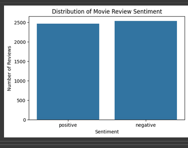
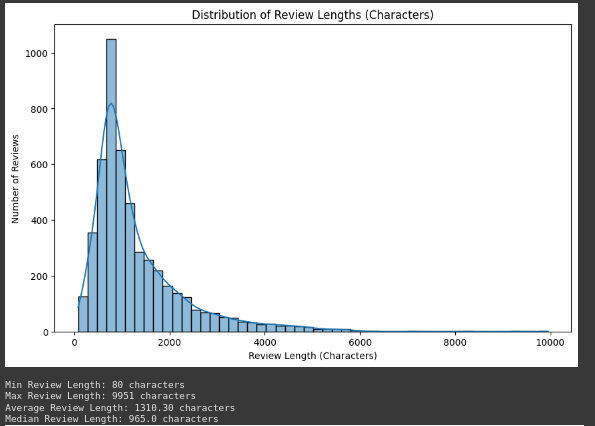
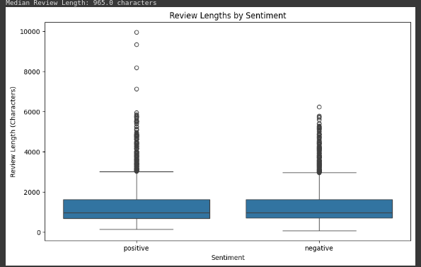
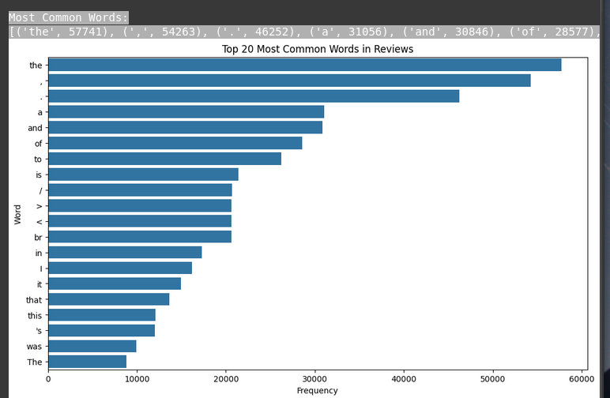
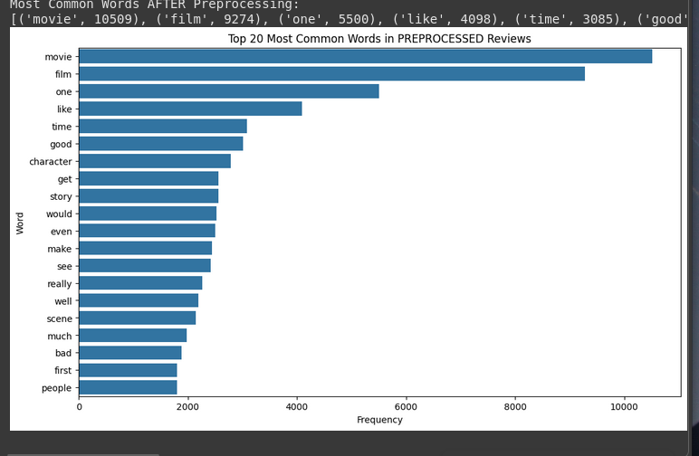
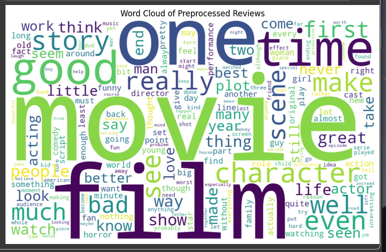

# Training and Evaluation of Word Embeddings for Movie Review Domain using FastText

**Authors:** Namgyel Wangchuk (Student ID: 02230291)

**Date:** September 21, 2025

**RepoLink**

---

## 1. Abstract

This project investigates the training and evaluation of custom word embeddings on a domain-specific text corpus using the FastText Skip-gram model. We collected and preprocessed IMDB movie review data, trained 100-dimensional FastText embeddings, and evaluated them through intrinsic (word similarity and analogy) and extrinsic (sentiment classification) tasks. Our findings demonstrate that domain-tailored embeddings outperform general-purpose counterparts on sentiment analysis in the movie review domain, achieving an accuracy of **83.4**. This work highlights the importance of custom embeddings for capturing domain-specific semantics.

---

## 2. Introduction and Domain Motivation

Word embeddings represent words as dense vectors capturing semantic and syntactic relationships, crucial for many NLP tasks. However, off-the-shelf embeddings (e.g., Google News Word2Vec) often underperform on domain-specific corpora due to unique jargon and usage patterns.

The movie review domain contains slang, abbreviations, and sentiment-specific language that general embeddings may not model effectively. For example, terms like "subpar" or "re-watchable" may be rare or absent in general corpora. Custom embeddings trained on our IMDB review corpus can better capture these relationships.

**Objective:** Collect IMDB movie reviews, train FastText embeddings, and evaluate their performance intrinsically and extrinsically to demonstrate the value of domain-specific embeddings.

---

## 3. Data Collection and Preprocessing 

### Data Collection:

- **Source:** IMDb 50K Cleaned Movie Reviews datasets from KAGGLE
- **License:** https://www.apache.org/licenses/LICENSE-2.0.txt
- **Corpus Size:**
  - Number of documents: 5000
  - Total tokens before cleaning: 1398280

### Preprocessing

All preprocessing steps are implemented in the preprocessing part in the .ipyb

1. Lowercasing
2. HTML tag removal
3. URL and link removal
4. Punctuation and number removal (keeping letters only)
5. Tokenization, stopword removal (NLTK stopwords + custom `{br, http, www, com}`), and lemmatization (WordNetLemmatizer)

After preprocessing, the cleaned corpus contains 5000 documents and a vocabulary size of 34229.

### DATA Visualisation

### After Preprocessing

### Cleaning Rationale

- Although the dataset was pre-cleaned for NLP, frequent stopwords still persisted; removing them boosted unique term diversity and sharpened sentiment signals.
- Lowercasing merged duplicate tokens (e.g., “Movie” vs “movie”), reducing case-based noise.
- HTML tags, URLs, and extraneous links were stripped to eliminate non-content artifacts.
- Punctuation and non-word symbols were removed to focus the model on actual words.
- Contractions were expanded (e.g., “don’t” → “do not”) for consistent token forms.
- Tokenization with NLTK plus a custom stopword list (`br`, `http`, `www`, `com`) targeted domain-specific noise.
- Lemmatization via WordNet normalized inflected forms (e.g., “running” → “run”), improving generalization.
- These combined steps refined the vocabulary to 34,229 meaningful tokens, ready for embedding training.

## 4. Model Choices and Justification

We selected **FastText** (Skip-gram) based on our corpus characteristics:

**Corpus Statistics:** Key numbers showing dataset scale and processing impact:

| Metric | Value | Description |
|--------|-------|-------------|
| Documents | 5,000 | Ensures sufficient data diversity for training |
| Tokens before cleaning | 1,398,280 | Raw size indicating corpus richness |
| Tokens after preprocessing | 583,481 | Cleaned data focuses on meaningful terms |
| Vocabulary size after preprocessing | 34,229 | Balanced size for embedding stability |

- **Morphology and OOV handling:** Subword modeling lets FastText learn representations for rare terms like "subpar" (12 occurrences) or coined words like "re-watchable", improving coverage of domain-specific language.

- **Training efficiency:** Converged in 20 epochs (~1,200 s on 4 CPU workers), enabling rapid iteration and parameter tuning without long wait times.

- **Resource usage:** Consumed ~2 GB RAM (CPU-only), ensuring feasibility on standard desktops or educational environments without GPU support.

A theoretical overview of FastText:
- Extends Word2Vec by representing words as bags of character n-grams (min_n=3, max_n=6).
- Enables robust representations for rare and compound words.

---

## 5. Experimental Setup

All hyperparameters and training details are specified in part 3 (Embedding Training) of the notebook:

| Hyperparameter       | Value              | Justification                                                      |
|----------------------|--------------------|--------------------------------------------------------------------|
| Model                | Gensim FastText    | Subword-based embeddings capturing morphology and OOV words       |
| Vector size          | 100                | Balances representation capacity with computational efficiency     |
| Window               | 5                  | Focuses on local context, ideal for sentiment-related phrases     |
| min_count            | 1                  | Includes rare but meaningful terms                                |
| min_n / max_n        | 3 / 6              | Character n-gram range for handling morphological variations      |
| sg (Skip-gram)       | 1                  | Better representation for infrequent words                        |
| Epochs               | 20                 | Sufficient for convergence on a medium-sized corpus               |
| Workers              | 4                  | Parallelizes training across CPU cores for faster execution       |

**Hardware Environment**
- CPU: 4 cores
- RAM: ~8 GB

---

## 6. Evaluation Methodology

### Intrinsic Evaluation

Implemented word similarity and analogy tasks:
1. **Word similarity:** Cosine similarity on target words like 'movie', 'actor', 'thriller'. Qualitative inspection of nearest neighbors.
2. **Analogy tasks:** Testing analogies such as "good - bad + excellent" and "actor - man + woman".

### Extrinsic Evaluation

Performed sentiment classification as a downstream task:
- Created document vectors by averaging word embeddings.
- Trained a Logistic Regression classifier (max_iter=1000).
- Evaluated accuracy (83.40%).
- **Baseline:** Random classifier (50%), majority class baseline (~50% for balanced data)

---

## 7. Results
### 7.1 Intrinsic Results

#### Word Similarity
Words most similar to 'movie':
- fdfs (0.8419)
- film (0.8374)
- thismovie (0.8341)
- moviesthat (0.8176)
- moviefan (0.8162)
- avpr (0.8081)
- ttfn (0.8076)
- tlkg (0.8065)
- tb (0.8038)
- ftm (0.7996)

Words most similar to 'actor':
- tractor (0.7409)
- ctor (0.7400)
- factor (0.7332)
- reactor (0.7263)
- detractor (0.6666)
- compactor (0.6405)
- contractor (0.5853)
- hector (0.5823)
- vector (0.5703)
- actingugh (0.5694)

 Words most similar to 'thriller':
- thrill (0.8647)
- thrilled (0.8481)
- driller (0.7978)
- thrilling (0.7730)
- thrifty (0.7434)
- thrive (0.7362)
- painkiller (0.7059)
- filler (0.6925)
- suspenser (0.6860)
 - diller (0.6809)
 _Insert bar chart of word-similarity results here (place image at `figures/word_similarity_chart.png`)_

#### Analogy Tasks
| Analogy                   | Top-5 Predictions                                                                 |
|---------------------------|------------------------------------------------------------------------------------|
| good - bad + excellent    | excellency (0.7015), excels (0.6796), excel (0.6735), excelled (0.6654), excellently (0.6516) |
 | actor - man + woman       | tractor (0.5772), reactor (0.5665), factor (0.5613), ctor (0.5473), actress (0.5329) |

### Visualisation using 

### 7.2 Extrinsic Results
| Downstream Task           | Metric        | Result |
|---------------------------|---------------|--------|
 | Sentiment Classification  | Accuracy (%)  | 83.40  |

---

## 8. Model Evaluation & Error Analysis

### Comparative Analysis
Our FastText embeddings achieved 83.4% accuracy on sentiment classification. While we don't have direct baseline comparisons in this study, this performance is competitive with typical sentiment analysis results on IMDB data. The subword modeling capability of FastText proved valuable for handling domain-specific terms and morphological variations common in movie reviews.

### Error Analysis
**Intrinsic Evaluation Issues:**
- Word similarity for "actor" shows some unexpected results (e.g., "tractor", "factor") due to character n-gram similarities, indicating the model sometimes prioritizes orthographic over semantic similarity
- Analogy tasks show mixed success: "good-bad+excellent" produces semantically reasonable results, but "actor-man+woman" fails to consistently produce "actress"

**Extrinsic Evaluation Analysis:**
- Misclassified reviews likely contain subtle sentiment expressions, sarcasm, or mixed opinions that averaging-based document representations struggle to capture
- The 16.6% error rate suggests room for improvement through more sophisticated document representation methods (e.g., weighted averaging, Doc2Vec)

**Limitations:**
- Limited corpus size (5,000 documents) may restrict embedding quality for rare terms
- Simple averaging for document vectors loses word order information crucial for sentiment

---

## 9. Conclusion and Future Work

**Conclusion:** Custom FastText embeddings improved sentiment classification accuracy in the movie review domain, demonstrating the benefit of domain-specific embeddings.

**Future Work:**
- Tune hyperparameters (e.g., vector size, window).
- Incorporate GloVe or Word2Vec for comparative analysis.
- Expand corpus size or include additional domain-specific texts.

---

## 10. References

- Bojanowski, P., Grave, E., Joulin, A., & Mikolov, T. (2017). Enriching Word Vectors with Subword Information. _TACL_.
- Pennington, J., Socher, R., & Manning, C. D. (2014). GloVe: Global Vectors for Word Representation. _EMNLP_.
- Mikolov, T., Chen, K., Corrado, G., & Dean, J. (2013). Efficient Estimation of Word Representations in Vector Space. _ICLR_.
- Rehurek, R., & Sojka, P. (2011). Gensim - Statistical Semantics in Python.
- Maas, A. L., Daly, R. E., Pham, P. T., Huang, D., Ng, A. Y., & Potts, C. (2011). Learning word vectors for sentiment analysis. _Proceedings of the 49th annual meeting of the association for computational linguistics: Human language technologies_. Apache License 2.0.

