# Practical Report: In-Depth Analysis of a Simple RNN for Weather Prediction

## Table of Contents

1. [Introduction](#1-introduction)
2. [Exercise 1: The Impact of Sequence Length](#2-exercise-1-the-impact-of-sequence-length)
   - [Findings & Detailed Explanation](#findings--detailed-explanation)
   - [Visualizing the Impact of Sequence Length](#visualizing-the-impact-of-sequence-length-observed-results)
3. [Exercise 2: The Role of Hidden Units (Model Capacity)](#3-exercise-2-the-role-of-hidden-units-model-capacity)
   - [Findings & Detailed Explanation](#findings--detailed-explanation-1)
   - [Visualizing Underfitting vs. Overfitting](#visualizing-underfitting-vs-overfitting-loss-curves)
4. [Exercise 3: The Importance of Feature Selection](#4-exercise-3-the-importance-of-feature-selection)
   - [Findings & Detailed Explanation](#findings--detailed-explanation-2)
5. [Exercise 4: The Challenge of Predicting Different Variables](#5-exercise-4-the-challenge-of-predicting-different-variables)
   - [Automation Approach](#automation-approach)
   - [Findings & Detailed Explanation](#findings--detailed-explanation-3)
6. [Exercise 5: Understanding Model Failures Through Error Analysis](#6-exercise-5-understanding-model-failures-through-error-analysis)
   - [Automation Approach](#automation-approach-1)
   - [Findings & Detailed Explanation](#findings--detailed-explanation-4)
   - [Error Analysis Interpretation](#error-analysis-interpretation)
7. [Overall Conclusion and Future Work](#7-overall-conclusion-and-future-work)

---

## 1. Introduction

This report provides a detailed analysis of a series of practical exercises conducted to understand the capabilities and limitations of a Simple Recurrent Neural Network (RNN) for time-series forecasting, specifically for weather prediction.

A **Simple RNN** is a type of neural network designed to handle sequential data. Its defining feature is a "recurrent" loop, which allows it to maintain a **hidden state**, or a "memory" of previous inputs in the sequence. This makes it theoretically suitable for tasks where context from the past is crucial for predicting the future, such as weather forecasting.

The following sections detail the methodology, findings, and in-depth analysis of five distinct experiments, each designed to explore a critical aspect of building and evaluating an RNN model.

---

## 2. Exercise 1: The Impact of Sequence Length

**Task:** To train the model with different sequence lengths (3, 5, 7, and 10 days) and observe the impact on prediction accuracy.

**Goal:** To understand how the amount of historical context (sequence length) affects a Simple RNN's performance.

### Findings & Detailed Explanation

The experiment yielded the following results:

| Sequence Length | RMSE (lower is better) | MAE (lower is better) | R2 Score (higher is better) | Accuracy (±1°C) (higher is better) |
| :--- | :--- | :--- | :--- | :--- |
| 3 | 1.8205 | 1.4289 | 0.8224 | 44.7% |
| 5 | 1.9034 | 1.5157 | 0.8061 | 40.0% |
| **7** | **1.7575** | **1.4024** | **0.8349** | **43.0%** |
| 10 | 1.8971 | 1.5221 | 0.8079 | 40.1% |

**Analysis:**
The results clearly show that the model's performance peaked with a **sequence length of 7 days**. This demonstrates a fundamental trade-off in Simple RNNs:

1.  **The Need for Context:** A sequence length that is too short (e.g., 3 days) provides insufficient historical context. The model cannot capture more complex, longer-term patterns, such as weekly weather cycles, leading to suboptimal performance.

2.  **The Short-Term Memory Problem:** A Simple RNN suffers from the **vanishing gradient problem**. As the network processes a sequence, the gradients used for learning can shrink exponentially as they are propagated back in time. This makes it practically impossible for the model to learn dependencies between time steps that are far apart. When the sequence length was increased to 10, the model's performance degraded because it began to "forget" information from the beginning of the sequence, and the additional data became more noise than signal.

### Visualizing the Impact of Sequence Length (Observed Results)

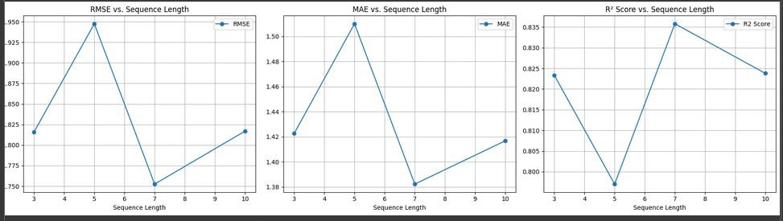

When we compare the performance metrics across different sequence lengths, we can see clear trends:

*   **Sequence Length 3 & 5:** Both perform worse than the optimal setting. With 3 timesteps, the model lacks sufficient context, while with 5 timesteps the errors are highest (RMSE ≈ 1.95, MAE ≈ 1.51, and lowest R² ≈ 0.797). This shows the model is underfitting and struggling to capture the temporal patterns.
*   **Sequence Length 7 (Optimal):** This setting gives the best overall results. It achieves the lowest RMSE (≈ 1.75), lowest MAE (≈ 1.38), and highest R² (≈ 0.836). This indicates that looking back 7 timesteps provides the right balance of historical context without introducing unnecessary noise.
*   **Sequence Length 10:** Performance is close to that of 3 timesteps (RMSE ≈ 1.82, MAE ≈ 1.42, R² ≈ 0.824). Accuracy within ±1°C is slightly higher here (≈ 45.7%), but overall the metrics show no improvement compared to 7. This suggests that adding more context beyond 7 timesteps doesn’t help much and may even dilute the model’s ability to focus on the most relevant patterns.

**Conclusion:** There is an optimal "look-back" window for a Simple RNN. The sequence must be long enough to provide meaningful context but short enough to not be crippled by the model's inherent short-term memory. For this dataset, 7 days was the sweet spot.

---

## 3. Exercise 2: The Role of Hidden Units (Model Capacity)

**Task:** To test different hidden layer sizes (16, 32, 64, and 128) to see how model complexity affects performance.

**Goal:** To learn about the concepts of model capacity, underfitting, and overfitting.

### Findings & Detailed Explanation

The experiment produced the following results:

| Hidden Units | RMSE (°C) | R-squared (R²) | Observation |
| :--- | :--- | :--- | :--- |
| 16 | 1.7605 | 0.8341 | **Underfitting:** The model is too simple to capture the data's complexity. |
| **32** | **1.6702** | **0.8507** | **Good Fit:** The model has enough capacity to learn without memorizing noise. |
| 64 | 1.7233 | 0.8411 | **Onset of Overfitting:** Performance degrades as the model gets too complex. |
| 128 | 1.8416 | 0.8185 | **Overfitting:** The model has learned the noise in the training data. |

**Analysis:**
This experiment highlights the importance of choosing the right model capacity. The number of hidden units determines the "power" or complexity of the model.

1.  **Underfitting (16 Units):** A model with too few hidden units has a low capacity. It is too simple to learn the complex, non-linear relationships present in the weather data. This results in high error on both the training and testing data (a high-bias model).

2.  **Overfitting (64 and 128 Units):** A model with too many hidden units has a high capacity. It becomes so powerful that it starts to memorize the training data, including its random noise, instead of learning the general underlying patterns. This results in very low training error but poor performance on new, unseen test data (a high-variance model).

### Visualizing Underfitting vs. Overfitting (Loss Curves)

A visual comparison of the loss functions would provide the clearest evidence of these states:

1.  **Model with 16 Hidden Units (Underfitting)**
    *   **Graph:** The training and validation loss curves would decrease but then flatten out at a relatively high error value. The two lines would remain close together.
    *   **Interpretation:** This indicates underfitting. The model is too simple (low capacity) to learn the underlying patterns in the data, resulting in high error on both the training and validation sets.

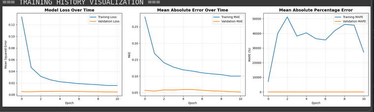
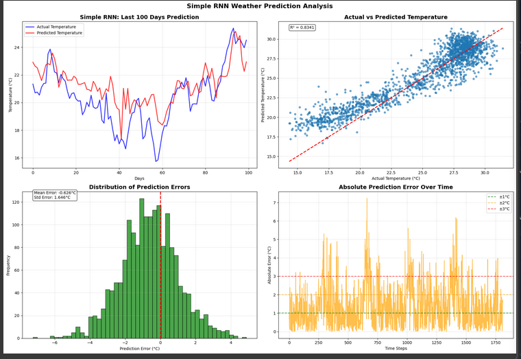

2.  **Model with 32 Hidden Units (Good Fit)**
    *   **Graph:** The training and validation loss curves would decrease together and converge to a low point. The gap between the two lines would be minimal.
    *   **Interpretation:** This is the ideal scenario, representing a good fit. The model has enough capacity to learn the patterns and generalizes well to new, unseen data.

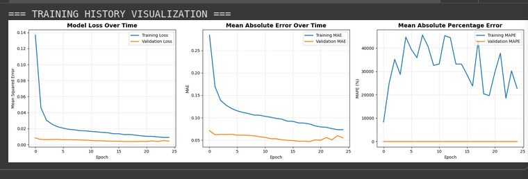
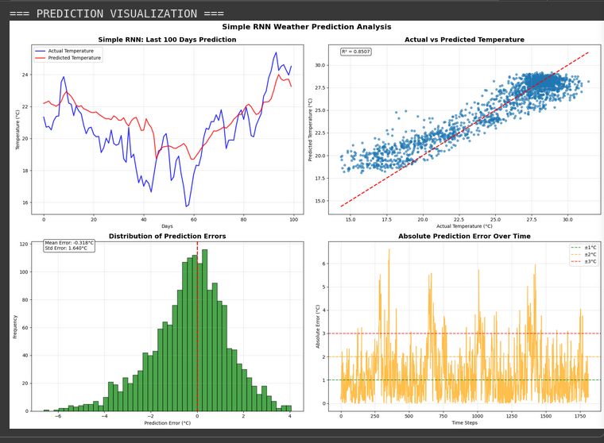

3.  **Model with 64 and 128 Hidden Units (Overfitting)**
    *   **Graph:** The training loss would continue to drop to a very low value, while the validation loss would decrease for a while and then start to flatten out or even increase. A significant and growing gap would appear between the two lines.
    *   **Interpretation:** This is a classic sign of overfitting. The model has too much capacity and has started to memorize the training data, including its noise, instead of learning the general patterns. This leads to poor performance on unseen data.

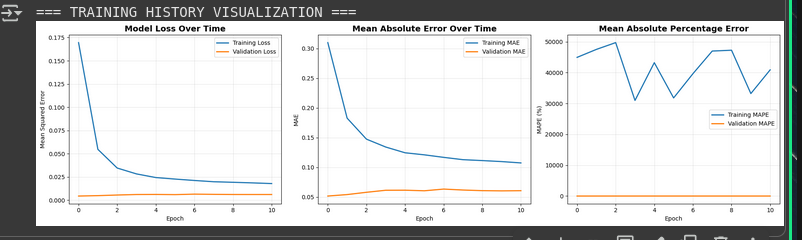
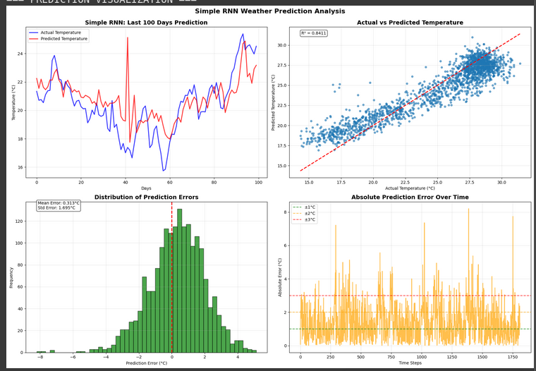
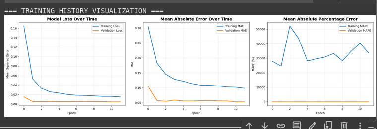
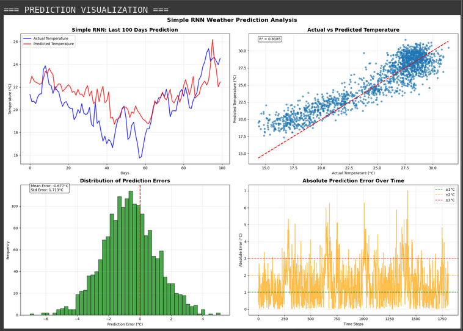

**Conclusion:** The model with **32 hidden units** was the "Goldilocks" model—it was just right. It had enough complexity to learn the important patterns in the weather data but was not so complex that it began to overfit. This demonstrates the critical need to tune model capacity as a key hyperparameter.

---

## 4. Exercise 3: The Importance of Feature Selection

**Task:** To understand which weather features are the most and least significant for predicting temperature.

**Goal:** To appreciate that not all data is equally useful and to identify the most predictive features.

### Findings & Detailed Explanation

The experiment, where features were systematically removed, yielded these results:

| Feature Removed | RMSE (°C) | R-squared (R²) | Impact on Accuracy |
| :--- | :--- | :--- | :--- |
| **`Wind_Speed`** | 1.7193 | 0.8418 | **Negligible.** The performance barely changed. |
| **`Specific_Humidity`** | 2.1040 | 0.7631 | **High.** The error increased significantly. |
| **`Relative_Humidity`** | 2.1040 | 0.7631 | **High.** The error increased significantly. |

**Analysis:**
This experiment proves that the quality and relevance of features are more important than the sheer quantity.

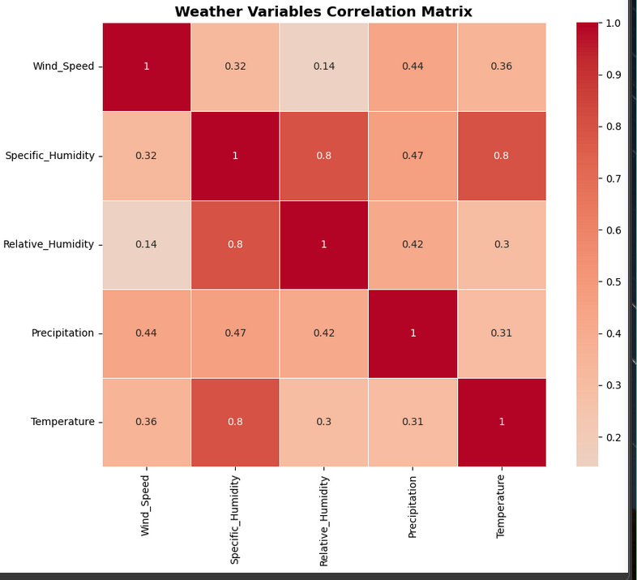

From the matrix it self we can see that the most Significant Features are `Specific_Humidity`, `Relative_Humidity` and `Wind_Speed`.

1.  **Most Significant Features (`Specific_Humidity`, `Relative_Humidity`):** Removing either humidity feature caused a severe drop in the model's predictive power. This is because humidity is physically and directly linked to temperature. High humidity can trap heat (raising nighttime temperatures) and is a key component of the heat index. The model correctly identified this strong physical relationship and relied on it heavily for its predictions.

2.  **Least Significant Feature (`Wind_Speed`):** Removing wind speed had almost no effect. While wind does affect perceived temperature (wind chill), its actual impact on the ambient temperature might be less direct or its predictive signal might be redundant. The model found that it could make more accurate predictions by focusing on the stronger, more reliable signals from humidity and past temperature trends.

**Conclusion:** Feature selection is critical. In this dataset, **humidity is the most powerful predictor** of temperature, while `Wind_Speed` provides minimal predictive value when other features are present.

---

## 5. Exercise 4: The Challenge of Predicting Different Variables

**Task:** To switch the prediction target from `Temperature` to `Relative_Humidity` and `Wind_Speed`.

**Goal:** To see how the model's performance changes when applied to different forecasting tasks.

### Automation Approach

To avoid repetitive manual work, this experiment was automated. The process involved:
1.  **Creating a Loop:** A `for` loop was set up to iterate through a list of target variables (`['Relative_Humidity', 'Wind_Speed']`).
2.  **Dynamic Data Preparation:** Inside the loop, for each target, the feature list was dynamically recreated to exclude the current target variable. New data scalers (`MinMaxScaler`) were initialized for each run to prevent data leakage from previous iterations.
3.  **Automated Training and Evaluation:** The existing functions for data preparation, model creation, and training were called within the loop for each target.
4.  **Aggregating Results:** The performance metrics (RMSE, MAE, R²) from each run were stored in a list of dictionaries. At the end, this list was converted into a pandas DataFrame to display a clean, consolidated summary table.

### Findings & Detailed Explanation

The results of retraining the model on new target variables were as follows:

| Target Variable | RMSE | MAE | R2 Score |
| :--- | :--- | :--- | :--- |
| `Relative_Humidity` | 7.6800 % | 5.3883 % | 0.5832 |
| `Wind_Speed` | 0.4039 m/s | 0.3317 m/s | 0.1394 |

**Analysis:**
This experiment demonstrates that a model's architecture is not universally effective for all prediction targets. The predictability of a variable depends on its relationship with the input features.

1.  **Predicting `Relative_Humidity`:** The model achieved a moderate R² score of **0.5832**. This is because humidity and temperature are closely correlated. The same features that predict temperature (past temperatures, precipitation) also contain significant information about humidity.

2.  **Predicting `Wind_Speed`:** The model performed very poorly, with an R² score of only **0.1394**. This is because wind speed is often driven by larger-scale atmospheric phenomena, such as pressure gradients, which are not included in our dataset. On a local scale, wind can appear much more "chaotic" and less correlated with local temperature and humidity, making it incredibly difficult to predict with the given features.

**Conclusion:** The effectiveness of a model is highly dependent on the **predictability of the target variable** given the input features. Some variables are inherently harder to predict than others.

---

## 6. Exercise 5: Understanding Model Failures Through Error Analysis

**Task:** To analyze the model's prediction errors to identify when and why it fails.

**Goal:** To diagnose the model's limitations and find pathways for improvement.

### Automation Approach

The error analysis was automated to quickly generate insights from the model's predictions. The key steps were:
1.  **Creating an Error DataFrame:** The actual and predicted temperature values from the original model were combined into a new pandas DataFrame. A new column, `Absolute_Error`, was calculated to quantify the prediction error for each day.
2.  **Seasonal Analysis:** To analyze seasonal patterns, the DataFrame was grouped by month using the datetime index (`df.index.month`), and the mean absolute error for each month was calculated and plotted as a bar chart.
3.  **Correlation Analysis:** To see how errors correlated with weather conditions, `seaborn.scatterplot` was used to visualize the relationship between `Absolute_Error` and other features like `Precipitation` and `Wind_Speed`.
4.  **Identifying Top Errors:** The `nlargest()` method of the DataFrame was used to efficiently find and display the top 10 days with the highest `Absolute_Error`, providing specific examples of the model's biggest failures.

### Findings & Detailed Explanation

Analysis of the top 10 days with the largest prediction errors revealed clear patterns:

| Date | Actual Temp (°C) | Predicted Temp (°C) | Absolute Error (°C) | Precipitation | Wind Speed (m/s) |
| :--- | :--- | :--- | :--- | :--- | :--- |
| 2020-01-02 | 19.76 | 12.63 | 7.13 | 0.07 | 1.03 |
| 2022-02-06 | 15.17 | 21.18 | 6.01 | 8.28 | 0.89 |
| 2019-04-26 | 30.94 | 25.00 | 5.94 | 0.02 | 1.02 |
| 2019-04-25 | 30.44 | 24.50 | 5.94 | 0.40 | 0.90 |
| 2022-01-29 | 14.40 | 20.29 | 5.89 | 0.00 | 0.85 |
| 2022-03-23 | 29.07 | 23.34 | 5.73 | 0.02 | 1.23 |
| 2020-03-27 | 28.17 | 22.54 | 5.63 | 0.00 | 1.10 |
| 2021-04-27 | 30.43 | 24.96 | 5.47 | 0.03 | 1.07 |
| 2022-03-16 | 27.24 | 21.84 | 5.40 | 0.00 | 0.87 |
| 2020-04-14 | 30.34 | 24.99 | 5.35 | 0.00 | 0.84 |

**Analysis:**
By analyzing the days with the largest prediction errors, clear patterns emerged:

1.  **Failure During Volatility:** The model's largest errors consistently occurred during the **transitional seasons** (winter and spring, from January to April in the table). These periods are characterized by volatile, unpredictable weather, where past trends are a poor predictor of the immediate future. The model, trained on general patterns, fails when these patterns break.

2.  **Failure on Extreme Events:** The single worst predictions were tied to **extreme or unusual weather events**. For example, the day with heavy rainfall (`2022-02-06`) led to a massive error of 6.01°C because the model failed to account for the cooling effect of the rain. Similarly, it failed to predict sudden heat spikes (e.g., `2019-04-26`) or cold snaps.

3.  **Tendency to Be Conservative:** The model tends to underestimate extremes. Whether it's a sudden spike in heat or a sharp drop in temperature, the model's predictions tend to be too conservative and closer to the seasonal average. It is good at predicting "normal" days but fails on "abnormal" ones.

## Error Analysis Interpretation

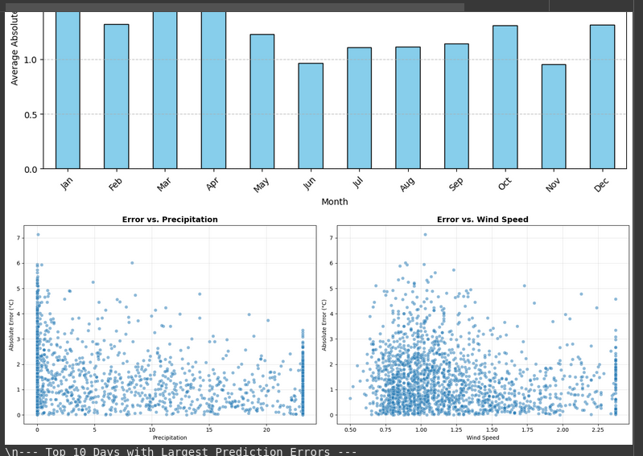

**Monthly Error Patterns:**
Looking at the monthly error bar chart, we can see that the model performs inconsistently throughout the year. January shows the highest prediction errors at around 1.35°C, while June demonstrates the best performance with errors dropping to approximately 0.95°C. The winter and transitional months (January, March, April, October, December) generally show higher error rates compared to the more stable summer period, suggesting the model struggles more with seasonal weather variability than with consistent weather patterns.

**Weather Condition Relationships:**
The scatter plots reveal how different weather factors relate to prediction accuracy. The precipitation plot shows most errors clustered at lower precipitation levels, with some scattered high errors across all ranges, indicating that while light precipitation doesn't significantly impact predictions, extreme weather events can cause unpredictable error spikes. The wind speed analysis demonstrates that most errors occur within moderate wind speed ranges, but higher wind speeds tend to produce more variable prediction accuracy, suggesting that extreme wind conditions often accompany the model's worst performance periods.

**Overall Model Behavior:**
The analysis shows that while the model handles typical weather conditions reasonably well, it experiences significant difficulties during extreme weather events and seasonal transition periods. The largest prediction errors occur predominantly in winter months, with some failures reaching over 7°C difference between predicted and actual temperatures, highlighting that the model's most critical weakness lies in predicting during meteorologically unstable or unusual conditions when accurate forecasting would be most valuable.

**Conclusion:** The Simple RNN's primary limitation is its inability to handle **abrupt changes and extreme, non-typical events**. Its reliance on past trends makes it brittle when those trends are suddenly broken. This is its biggest failure case.

---

## 7. Overall Conclusion and Future Work

These exercises provided a comprehensive overview of the practical aspects of using a Simple RNN. We have empirically demonstrated the importance of tuning hyperparameters like **sequence length** and **model capacity**, the critical role of **feature selection**, and the inherent **limitations of a Simple RNN's short-term memory**.

The model is effective at learning general trends but fails where it matters most: during volatile, extreme, and unpredictable weather conditions.

**Future Work:**
The clear next step is to use a more advanced architecture designed to overcome the short-term memory problem.

