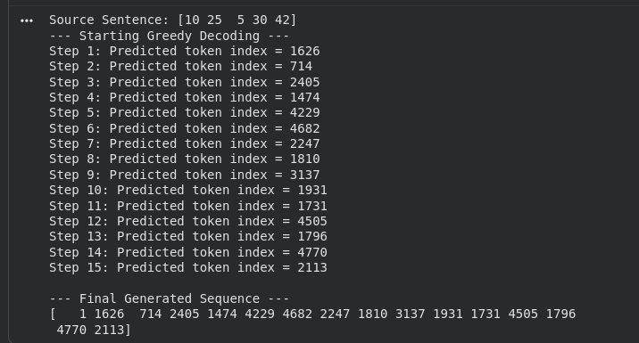

# Transformer Model: Report and Documentation

## 1. Architectural Explanation

### The Overall Structure of the Encoder and Decoder Stacks

The Transformer architecture is fundamentally composed of two main parts: an **Encoder** stack and a **Decoder** stack.

*   **The Encoder:** The role of the encoder is to process the entire input sequence (e.g., a sentence in the source language) and build a rich, context-aware representation of it. It consists of a stack of $N=6$ identical layers. Each layer contains two primary sub-layers: a **multi-head self-attention mechanism** and a **position-wise fully connected feed-forward network**. The self-attention mechanism allows each token in the input sequence to look at all other tokens to better understand its own meaning within the context of the sequence.

*   **The Decoder:** The role of the decoder is to generate the output sequence (e.g., the translated sentence) one token at a time. It is also composed of a stack of $N=6$ identical layers. In addition to the two sub-layers found in the encoder, the decoder inserts a third sub-layer: a **cross-attention mechanism**. This allows the decoder to focus on relevant parts of the encoded input sequence. The decoder's self-attention mechanism is also modified with a "look-ahead mask" to prevent it from cheating by looking at future tokens in the output sequence it is trying to generate.

### Mathematical Formulation and Role of Attention Mechanisms

**Scaled Dot-Product Attention:** This is the core building block of the Transformer's attention mechanism. It calculates a set of output vectors based on a query, a key, and a value. The formula is:

$$ \text{Attention}(Q, K, V) = \text{softmax}\left(\frac{QK^T}{\sqrt{d_k}}\right)V $$

*   **Role:** Conceptually, this mechanism determines how much focus or "attention" to place on each part of the input sequence when processing a specific token. The query ($Q$) represents the current token's interest, the key ($K$) represents the information other tokens have, and the value ($V$) represents the content of those other tokens. The dot product $QK^T$ computes a similarity score between the query and all keys. The scaling factor $\frac{1}{\sqrt{d_k}}$ is crucial for stabilizing gradients during training. Finally, the softmax function converts these scores into probabilities (weights), which are used to create a weighted sum of the values.

**Multi-Head Attention (MHA):** Instead of performing a single attention calculation, Multi-Head Attention runs the scaled dot-product attention mechanism multiple times in parallel.

*   **Conceptual Role:** This allows the model to jointly attend to information from different representational subspaces at different positions. A single attention head might learn to focus on syntactic relationships, while another might focus on semantic ones. The input queries, keys, and values are first passed through separate linear projections for each of the $h=8$ heads. The attention function is applied to each head's projected inputs, and the resulting output vectors are concatenated and passed through a final linear layer. This enriches the model's ability to capture complex relationships in the data.

### Function of Positional Encoding and Masking

**Positional Encoding:** The Transformer architecture does not contain any recurrent or convolutional layers. To provide the model with information about the order of the tokens in a sequence, we inject **positional encodings** into the input embeddings. These are fixed sine and cosine functions of different frequencies:

$$ PE_{(pos, 2i)} = \sin(pos / 10000^{2i/d_{\text{model}}}) $$
$$ PE_{(pos, 2i+1)} = \cos(pos / 10000^{2i/d_{\text{model}}}) $$

*   **Necessity:** Without positional information, the model would treat the input as a "bag of words," losing all sequential context. For example, the sentences "The cat chased the dog" and "The dog chased the cat" would appear identical to the model.

**Masking:**
*   **Padding Mask:** Since sentences in a batch have different lengths, we pad shorter sentences with a special `<PAD>` token to make them uniform. The padding mask ensures that these padding tokens are ignored during the self-attention calculation, so they do not contribute to the context of the real tokens.
*   **Look-Ahead (Causal) Mask:** This mask is essential for the decoder. During training and inference, the decoder generates the output sequence token by token. To prevent the model from "cheating" by looking at future tokens it is supposed to predict, the look-ahead mask is applied to the decoder's self-attention mechanism. It masks out all future positions, ensuring that the prediction for token $i$ can only depend on the known outputs at positions less than $i$.

---

## 2. Code Structure and Design

### Class Hierarchy and Modular Design Choices

The implementation follows a logical, bottom-up, and modular design, which is crucial for readability, maintainability, and debugging.

*   **Base Function (`scaled_dot_product_attention`):** The core attention formula is implemented as a standalone function since it is stateless and reused directly by the `MultiHeadAttention` module.
*   **Core Components (`MultiHeadAttention`, `PositionwiseFeedForward`, `PositionalEncoding`):** These are the fundamental building blocks of the Transformer. Encapsulating them into their own `nn.Module` classes (e.g., `MultiHeadAttention`) makes the code highly reusable and clean. For instance, separating `MultiHeadAttention` is a key design choice because it is used in three different places: the encoder layer, and twice in the decoder layer (for self-attention and cross-attention). This avoids code duplication.
*   **Layer Components (`EncoderLayer`, `DecoderLayer`):** These classes act as wrappers that assemble the core components into a single, cohesive layer. This abstraction simplifies the final model construction, as we can just stack these layers.
*   **Stack Components (`Encoder`, `Decoder`):** These modules are responsible for creating a stack of $N$ layers, managing the input embeddings, and applying positional encodings.
*   **Top-Level Model (`Transformer`):** This final class brings everything together. It contains an `Encoder` instance, a `Decoder` instance, and the final linear projection layer. It is also responsible for creating and applying the necessary masks for the forward pass.

This hierarchical structure directly mirrors the conceptual architecture of the Transformer, making the codebase intuitive to navigate.

### Role and Implementation of Residual Connections and Layer Normalization

In the `EncoderLayer` and `DecoderLayer`, every sub-layer (like self-attention or the feed-forward network) is wrapped with a residual connection and layer normalization.

**Implementation:**
This is implemented in the `forward` pass of the layers, following this pattern:
```python
# Example from EncoderLayer
# 1. Apply the sub-layer (self-attention)
attn_output = self.self_attn(x, x, x, mask)
# 2. Add the original input (residual connection) and apply dropout
# 3. Apply layer normalization
x = self.norm1(x + self.dropout(attn_output))
```

**Role:**
*   **Residual Connections (`x + ...`):** These are "skip connections" that allow the gradient to be directly backpropagated to earlier layers. In very deep networks like the Transformer, this is critical for preventing the **vanishing gradient problem**, where gradients become too small to effectively update the weights of the initial layers. It also allows a layer to learn a modification to the identity function, which is often easier than learning a completely new transformation.
*   **Layer Normalization (`self.norm(...)`):** This technique normalizes the outputs of each sub-layer to have a mean of 0 and a standard deviation of 1 (per sample in the batch). This stabilizes the training dynamics, reduces the sensitivity to weight initialization, and often allows for faster convergence. It is applied *after* the residual connection.

## 3. Hand-Drawn Architecture and Implementation Reference


### Component Reference for Verification

To complement the hand-drawn diagram, the following tables provide a reference to help locate and verify that the architectural components shown in the diagram are consistent with the final `.ipynb` implementation.

 **The Diagram and `.ipynb` Implementation DO MATCH!**

#### 1. Encoder Stack Reference

| Component                      | Diagram Label                          | `.ipynb` Code Reference                                 |
| :----------------------------- | :------------------------------------- | :------------------------------------------------------ |
| **Input Embedding**            | `nn.Embedding`                         |  `self.embedding = nn.Embedding(...)`                 |
| **Positional Encoding**        | `PositionalEncoding` (with `+`)        |  `PositionalEncoding` class with sine/cosine          |
| **Multi-head Self-Attention**  | `MultiHeadAttention`                   |  `MultiHeadAttention` class                           |
| **Add & Norm**                 | "Add & Norm"                           |  `self.norm1(x + self.dropout(attn_output))`          |
| **Feed Forward**               | `PositionwiseFeedForward`              |  `PositionwiseFeedForward` class                      |
| **Add & Norm**                 | "Add & Norm"                           |  `self.norm2(x + self.dropout(ff_output))`            |
| **Stack (N×)**                 | `Encoder (N=6x)`                       |  `nn.ModuleList([EncoderLayer(...) for _ in range(N)])` |

#### 2. Decoder Stack Reference

| Component                           | Diagram Label                         | `.ipynb` Code Reference                                   |
| :---------------------------------- | :------------------------------------ | :-------------------------------------------------------- |
| **Output Embedding**                | `nn.Embedding`                        |  `self.embedding = nn.Embedding(...)`                   |
| **Positional Encoding**             | `PositionalEncoding` (with `+`)       |  `PositionalEncoding` class                             |
| **Masked Multi-head Self-Attention**  | `MultiHeadAttention` (Masked)         |  `self.self_attn(x, x, x, tgt_mask)` with mask           |
| **Add & Norm**                      | "Add & Norm"                          |  `self.norm1(x + self.dropout(attn_output))`            |
| **Multi-head Cross-Attention**      | `MultiHeadAttention`                  |  `self.cross_attn(x, enc_output, enc_output, src_mask)` |
| **Add & Norm**                      | "Add & Norm"                          |  `self.norm2(x + self.dropout(cross_attn_output))`      |
| **Feed Forward**                    | `PositionwiseFeedForward`             |  `PositionwiseFeedForward` class                        |
| **Add & Norm**                      | "Add & Norm"                          |  `self.norm3(x + self.dropout(ff_output))`              |
| **Stack (N×)**                      | `Decoder (N=6x)`                      |  `nn.ModuleList([DecoderLayer(...) for _ in range(N)])`   |

#### 3. Final Output Processing Reference

| Component     | Diagram Label      | `.ipynb` Code Reference                                    |
| :------------ | :----------------- | :--------------------------------------------------------------- |
| **Linear Layer** | `nn.Linear`        |  `self.final_linear = nn.Linear(d_model, tgt_vocab_size)`      |
| **Softmax**      | `Softmax`          |  Applied during inference (implicitly in `CrossEntropyLoss`)   |

#### 4. Hyperparameters Reference

This table provides a reference to confirm that the hyperparameters used in the code align with the base model configuration specified in the project guide.

| Parameter | Notation | Guide Value | `.ipynb` Code Value |
| :-------- | :------- | :---------- | :------------------ |
| `d_model` | $d_{model}$ | 512         |  512              |
| `N`       | $N$      | 6           |  6                |
| `h`       | $h$      | 8           |  8                |
| `d_k`, `d_v` | $d_k, d_v$ | 64          |  64               |
| `d_ff`    | $d_{ff}$ | 2048        |  2048             |
| `dropout` | $p_{dropout}$ | 0.1         |  0.1              |

---

## 4. Inference and Generation: Greedy Decoding Example

To demonstrate how the implemented Transformer can be used for sequence generation, a simple inference test using a **greedy decoding** strategy was included in the notebook.

### Purpose and Method

*   **What is it?** This test simulates the process of generating an output sequence (e.g., a translation) from a given input sentence. Greedy decoding is an inference algorithm that, at each step, selects the single most likely token from the model's output distribution as the next token in the sequence.

*   **Why was it done?** The primary purpose was to provide a practical, step-by-step demonstration of the Transformer's auto-regressive nature. While the forward pass test confirms dimensional correctness, this test shows how the model's components work together in a generative loop, which is its ultimate function.

*   **How does it work?** The process is as follows:
    1.  The model is given the full source sentence and an initial target sequence containing only a "start-of-sequence" (`<SOS>`) token.
    2.  It performs a forward pass and predicts the logits for the next token.
    3.  The token with the highest probability (the "greedy" choice) is selected using `argmax`.
    4.  This predicted token is appended to the target sequence.
    5.  This new, longer target sequence is fed back into the model in the next iteration.
    6.  The loop continues until the model predicts an "end-of-sequence" (`<EOS>`) token or a predefined maximum length is reached.

### Execution Output

The following output was generated by running the greedy decoding loop with the randomly initialized model:



### Analysis of the Result

The output demonstrates that the model is successfully generating a sequence of tokens auto-regressively. However, it is crucial to note that **the generated sequence is meaningless**. Since the model's weights are randomly initialized and it has not been trained on any data, the predicted token at each step is arbitrary.

The key takeaway from this test is not the quality of the output, but the confirmation that the **generative mechanism is functioning correctly**. It successfully links the encoder and decoder, uses the decoder's output from one step as input for the next, and builds a new sequence token by token, validating the structural integrity of the complete architecture for its intended task.

